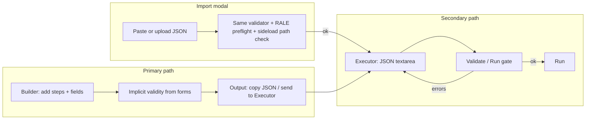

# Action Script enhancements — design note

This document explores improvements to **Action Scripts**: authoring UX (builder-first), variables, control flow, reuse, and CLI execution. It assumes the current model—JSON documents with a top-level `steps` array, validated by `validator.js` and executed linearly by `runScript` in `executor-engine.js`—and asks how far to extend it without losing clarity or safety.

**Related notes:** [rale-builtins-action-scripts-integration.md](./rale-builtins-action-scripts-integration.md), [wait-node-field-condition.md](./wait-node-field-condition.md).

## Current state (anchors)

| Concern | Location |
|--------|----------|
| Step types and per-type fields | `apps/roku-dev-studio/renderer/components/action-scripts/action-registry.js` (`STEP_SCHEMA`) |
| Parse + structural validation | `apps/roku-dev-studio/renderer/components/action-scripts/validator.js` (`parseAndValidateScript`, `validateScript`) |
| Execution | `apps/roku-dev-studio/renderer/components/action-scripts/executor-engine.js` (`runScript`) |
| Form-based authoring | `apps/roku-dev-studio/renderer/components/action-scripts/builder.js` |
| Raw JSON + run UI | `apps/roku-dev-studio/renderer/components/action-scripts/executor.js` |
| Import modal (paste/upload → executor) | `apps/roku-dev-studio/renderer/components/action-scripts/import-modal.js` |
| RALE builtin args | `rale-command-args.js`, shared with inspector |

**Where validation runs today:** both **Executor** (Validate / Run path in `executor.js`) and the **Import Action Script modal** (`import-modal.js` → `runFullValidation`) follow the same pattern:

1. When the script needs RALE (`scriptNeedsRaleConnection`), ensure App Connector / **`raleFunctions`** as needed (`ensureRaleFunctionsWhenScriptNeedsRale` in Import; equivalent flow in Executor).  
2. **`parseAndValidateScript`** from `validator.js` (parse JSON + `validateScript`).  
3. **Sideload paths:** for each `sideload` step, **`actionScriptCheckFileExists`** when the Electron bridge is available.

The modal also uses **`formatScriptJson`** for light formatting and basic shape checks when pasting/opening. Neither surface uses a separate validator implementation.

Today, execution is essentially **sequential**: each step runs after the previous unless skipped/paused/stopped by the UI. Step outputs are shown in the UI but are **not** modeled as named values for later steps. Validation is **batch** (validate button / on import), not continuous in the executor textarea.

---

## 1. Autocomplete and validation — **builder-first authoring**

**Decision:** Users should **author** action scripts primarily in the **Builder** (`builder.js`): structured fields, presets, and RALE/App Connector–aware controls already encode `STEP_SCHEMA` and shared validation. That **minimizes** invalid scripts without investing in a schema-heavy JSON editor (Monaco, JSON Schema completions, etc.) in the Executor textarea.

**Goal (reframed):** Keep **one** guided authoring surface; keep the **Executor** JSON view as **review, import, hand-edit, and run** — with clear expectations that hand-edited JSON is “you’re on your own” until Validate/Run, not a first-class smart editor.

### Intended workflow



### What we invest in

- **Builder UX and coverage:** New step types, options, and constraints land in `action-registry.js` / builder first; validator stays aligned (single source of truth).  
- **Executor (light touch):** Keep **Validate** and **Run** gating on `parseAndValidateScript`; **validation errors** list **Action N:** lines and, when the script parses to a `steps` array, render a **read-only** Actions list with **red outline** on failing steps and **scroll the list** to the first failing step (`executor.js`, `actions-list-view.js`).  
- **Run without re-validation:** After a successful Validate, **Run** does not call `parseAndValidateScript` again until the user **edits the JSON** (textarea `input`) or **leaves the device panel’s Action Scripts inner tab** (`innertabswitch` away from `actionscripts`), which clears the in-memory validated snapshot (`lastValidScript` / `lastValidatedRaw`). A full **app restart** also clears it.  
- **Import modal:** Keep **Validate** (and import path) using the same validator; it already adds **App Connector** setup when the script needs RALE and **sideload file** checks — document this so support knows Builder vs Import vs Executor all converge on `validator.js`. **No extra Builder nudge** in the modal (paste/upload + validation is enough).  
- **Copy/import:** Preserve smooth **Copy to Executor**, save/load, and import flows so JSON remains the interchange format without requiring users to type it from scratch.  
- **UI nudge:** Short hint on the Executor subtab that **Builder** is the recommended way to compose scripts (`index.html`).  
- **Default subtab:** On load, Action Scripts opens on **Builder** (`action-scripts/index.js` resets subtab state when the component initializes).

### What we defer / drop (for this enhancement)

- **Monaco / CodeMirror + JSON Schema** in the Executor for inline completions.  
- **Debounced live JSON lint** as a product requirement (optional nice-to-have only if cost is trivial).  
- **Snippets panel** for raw JSON unless we discover a concrete gap the builder cannot fill.

### Open questions (remaining for §1)

- For **CLI** and **CI**, JSON files are still authoritative — ensure any future **variables/includes** remain representable as JSON after preprocessing, or document “author in app, export JSON” as the team workflow.

**Resolved (Item 1):** Default subtab **Builder**; **no** Import-modal Builder nudge; **step-indexed errors + scroll** on validate failure; **Run** skips re-validation until JSON edit or leaving Action Scripts (or app restart); **no JSON → Builder round-trip** for now (validate + hand-edit is enough).

---

## 2. Variables and expressions

**Goal:** Let later steps reuse **return data** from **App Function** and **RALE Command** without copying large JSON by hand.

### Decision (v1)

- **Only `appFunction` and `raleCommand`** may define an optional string field **`assignToVar`**: a variable name (identifier: `[a-zA-Z_][a-zA-Z0-9_]*`) under which the step’s **`result.data`** is stored for the rest of the run (in-memory only). Legacy scripts may still use **`output`**; it is treated the same if `assignToVar` is absent.  
- **Builder:** optional field **“Set Var (optional)”** when the action type is App Function or RALE Command (serializes as `assignToVar`).  
- **Validator:** rejects `assignToVar` / legacy `output` on any other step type, invalid names, and **duplicate** resolved names across the script.  
- **Consumption:** later steps may use **`{{variableName}}`** or **dot paths** **`{{root.key.subkey}}`** in **string** values anywhere in the step object (including nested `args` / `functionParams` strings). After the root name, each segment is a property key on an object or a **0-based array index** (digits only), e.g. `{{data.beverages.1.favorite}}` on `{ "beverages": [ {}, { "favorite": "soup" } ] }` → `soup`. Segments may contain spaces around dots in the authored string (they are trimmed). **Missing** root variable, **missing** path, **invalid** segment characters, or **non-traversable** value mid-path → substitute **empty string** (silent; run continues). Substitution is **not** applied to `password` / `devPassword`. Non-string fields are walked recursively.  
- **Skipped** or **failed** producer steps do **not** assign a variable; producers must succeed and return `data` for the binding to occur.  
- **Shared implementation:** `packages/roku-dev-studio-api/lib/action-script-variables.js` (**CommonJS** for Node). **`rds` `script-runner.js`** `require`s it directly. The **Electron renderer** uses the same logic via **`window.actionScriptVariables`** (preload exposes the module) and `action-script-variables-client.js` re-exports for `validator.js` / `executor-engine.js`.  

### Deferred (not v1)

- Built-ins such as `{{device.ip}}` / `{{runId}}`.  
- Full expression language, branching on variable values (see §3).  
- Capturing outputs from `query`, `launch`, etc.

### Security

- No `eval`; templates are literal `{{path}}` replacement only (root + optional dot-separated keys/indices).  
- Password fields are excluded from substitution.

---

## 3. Conditional branching and loops

**Goal:** Move from a fixed list to **lightweight automation**: if a launch fails, skip a block; repeat a key sequence N times; retry until a wait succeeds.

### Resolved slice: `if` (v2 only)

**Script versions**

- **`version: "1"` (default):** Top-level `steps` only; **`if` is not allowed** (validator error).
- **`version: "2"`:** `steps` may include **`if`** nodes with **`then`** and **`else`**, each an array of nested steps. Empty else is represented as **`else: []`**.

**`if` step shape**

- **`type: "if"`**  
- **`condition`:** object with **`source`** one of **`media-player`** | **`rale-node-field`** | **`variables`**.  
  - Evaluation is **one-shot** (no polling); same *kinds* of fields as **wait** where applicable (media state / RALE path, id, field, operator, value, case-insensitive).  
  - **`variables`:** `variablePath` is a dot path **`x`** or **`x.a.0.b`** (no `{{…}}`). Validator requires the **root** segment to appear on an **earlier** step’s **`assignToVar`** in **preorder**. At runtime, missing values still participate in evaluation (e.g. undefined → predicates behave like empty / not present; no hard-fail solely for “missing var”).  
  - Operand types: allow **non-string** values where relevant (numbers/booleans/JSON-shaped values), consistent with variable storage and RALE field coercion.  
- **`then`:** array of steps (may be empty).  
- **`else`:** array of steps (may be empty; prefer **`[]`**).

**Preorder indices**

- Step indices for **Skip**, **onStepStart** / **onStepEnd**, and validation messages use a **single preorder** over the tree: visit each step, then the full **`then`** subtree, then the full **`else`** subtree.  
- **Pause** pauses; **Skip** skips the **`if`** step and **all** nested steps under it (entire subtree indices); **Stop** stops the run.

**Builder / list UI**

- Actions list is rendered from the **same preorder** with **depth indent** for nested steps.  
- **Drag reorder** is **disabled** when the tree contains any **`if`** (flat reorder is ambiguous); root-only scripts keep reorder.  
- **Insert target:** no “Add to” dropdown — each row has **After+** (same-level insert after that step); **`if`** rows also have **Then+** / **Else+** to queue the next add for that branch, plus a short hint under “Add step” and **End of script instead** to clear.

**Shared implementation**

- Tree helpers: `action-script-tree.js` (renderer).  
- Package: `action-script-step-tree.js` (preorder flatten + subtree sizes for CLI), `action-script-if-eval.js` (evaluate + validate condition shape), `rale-node-field-compare.js` (RALE field string extraction aligned with wait).  
- Preload: **`window.actionScriptIf`**, **`parseVariableDotPath`** on **`window.actionScriptVariables`**.

**Deferred (not this slice)**

- **`repeat`**, arbitrary loops, **`goto`/labels**.  
- Reorder / move steps inside the tree via drag-and-drop (use **Add to → If → then/else** and delete for now).

### Options (historical)

1. **Control steps (minimal extension)** — `goto`-style; rejected for validation/UX.  
2. **Nested blocks + version field** — **chosen** for `if`.  
3. **External DSL** — deferred.

### Execution engine changes (done for `if`)

- Recursive execution with a **flat preorder cursor** (`flattenStepsPreorder`) so skipped branches advance `fi` over the non-run subtree.  
- **Condition evaluation** in package; renderer uses preload bridge; **`script-runner`** uses the same module.

---

## 4. Import and reuse

**Goal:** Share **setup/teardown** or common sequences across scripts without copy-paste.

### Options

1. **`include` step**  
   `{ "type": "include", "path": "./common-setup.json" }` resolved at load time.  
   - **Pros:** Explicit; works with files on disk (CLI, Electron).  
   - **Cons:** Path resolution rules (relative to script file vs CWD); **circular include** detection; security when paths are user-controlled.

2. **`extends` / merge at top level**  
   `{ "extends": "base.json", "steps": [ ... ] }` with defined merge rules.  
   - **Pros:** Good for “base + overrides.”  
   - **Cons:** Merge semantics are easy to get wrong (order of steps, password fields).

3. **Library IDs (registry)**  
   Named bundles resolved from a known directory or URL.  
   - **Pros:** Shareable across teams.  
   - **Cons:** Needs packaging story and versioning.

### Resolution pipeline

A **preprocessor** stage (before `validateScript`):

1. Load root script.  
2. Recursively expand includes with **cycle detection** and **max depth**.  
3. Produce a **single flat or v2 AST** for validation and execution.

Electron already has file dialogs and `actionScriptCheckFileExists`; CLI would use filesystem paths or stdin.

### Recommendations

- Start with **explicit `include` only**, synchronous resolution, depth limit (e.g. 10), and **optional** `name` for stack traces (“included from X”).  
- Document that **validation errors** report logical line/step after expansion (may differ from raw file).

---

## 5. CLI execution

**Goal:** Run the same automation **headlessly** in CI or local terminals, aligned with import/reuse (paths relative to project).

### Dependencies

- **Device access:** HTTP ECP + optional RALE/WebSocket path must be available outside Electron. The desktop app today uses renderer `api` + preload IPC for files; a CLI would use a **Node** (or other) client that speaks the same protocols. Any `packages/roku-dev-studio-api` or relay work should expose **the same operations** `executor-engine` expects (`query`, `post`, `keypress`, `raleCommand`, …).

- **Engine reuse:** Prefer extracting **pure** `runScript` + validation into a shared module importable from CLI (no `window.roku`); inject file IO and screenshot save via adapters (Electron vs `fs`).

### UX sketch

```text
roku-dev-studio action-script run ./scripts/smoke.json \
  --device 192.168.1.10 \
  --password-env ROKU_DEV_PASSWORD \
  --output ./runs/
```

### Recommendations

- Define a **host adapter interface** (network, filesystem, optional screenshot) implemented by Electron renderer and by CLI.  
- **Exit codes:** 0 success, non-zero on validation failure vs step failure vs connection failure (documented).  
- **Secrets:** env vars or `.env` (gitignored), not committed in JSON.

---

## Phasing suggestion

| Phase | Scope |
|-------|--------|
| **A** | Builder-first + default Builder tab; validate UX (error rows + scroll); Run uses validated snapshot until edit or leave tab; no Monaco |
| **B** | Run context + string templates + named step outputs (subset of step types) |
| **C** | `include` preprocessor + path rules + cycle limits |
| **D** | CLI + shared runner package; screenshot/results folder parity |
| **E** | Branching/loops (v2 schema or nested blocks) once variables exist |

---

## Risks and non-goals (for early slices)

- **Risks:** Expression injection; unbounded loops; include path traversal; hand-edited JSON drifting from what the builder can round-trip.  
- **Non-goals (initially):** Full visual debugger, distributed runs across many devices, Monaco/schema-driven Executor, or replacing the builder with JSON-only authoring.

---

## Decision log (to fill in as the team picks options)

| Topic | Decision | Date |
|-------|----------|------|
| Authoring surface | **Builder primary** for creating/editing steps; Executor JSON = review / import / advanced edit + validate/run (no smart JSON editor requirement) | 2026-04-03 |
| Builder nudge in UI | **Yes** — short Executor hint pointing users to Builder for guided authoring | 2026-04-03 |
| Import modal validation | Uses **`parseAndValidateScript`** like Executor, plus **`runFullValidation`**: App Connector + `raleFunctions` when script needs RALE, sideload **`filePath` exists** check (`import-modal.js`) | 2026-04-03 |
| Default Action Scripts subtab | **Builder** on init (`setupActionScripts` in `index.js`) | 2026-04-03 |
| Import modal copy | **No** extra “use Builder” copy; validation covers pasted JSON | 2026-04-03 |
| Validate error UX | **Action N:** messages; failing steps highlighted; **scroll** Actions list to first failure (`executor.js`, `actions-list-view.js`) | 2026-04-03 |
| Run vs Validate | **Run** does not re-validate if JSON unchanged and user stayed on Action Scripts; **invalidate** on textarea edit or `innertabswitch` away from `actionscripts` | 2026-04-03 |
| JSON → Builder round-trip | **None** for now; Validate + Executor/Import flows are sufficient | 2026-04-03 |
| Expression model | **v1:** optional **`assignToVar`** on **appFunction** / **raleCommand** (legacy **`output`**); **`{{name}}`** / dot paths in later strings; shared `action-script-variables.js` | 2026-04-03 |
| Script version / AST | **`version: "1"`** flat steps only (no `if`); **`version: "2"`** allows **`if`** with **`then`** / **`else`** arrays; preorder indices for skip/UI/validation; **`else: []`** when empty | 2026-04-03 |
| `if` condition sources | **media-player** (one-shot), **rale-node-field**, **variables** (`variablePath` dot path; root must be assigned earlier in preorder) | 2026-04-03 |
| Include semantics | TBD | |
| CLI package layout | TBD | |
