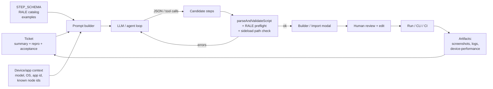

# AI-assisted ticket → Action Script generation — discussion note

Exploratory write-up of how we could feed a **feature request or bug ticket** into an AI system and get back a runnable **Action Script** that exercises / reproduces the scenario. No implementation is proposed here; this is a design conversation.

**Related notes:**
- [action-script-enhancements-design.md](./action-script-enhancements-design.md) — Builder-first authoring, variables, `if`, CLI.
- [rale-builtins-action-scripts-integration.md](./rale-builtins-action-scripts-integration.md) — RALE command surface reused by `raleCommand` steps.
- [automated-channel-testing-and-dev-studio.md](./automated-channel-testing-and-dev-studio.md) — how Dev Studio overlaps with the WebDriver automation stack.
- [cli-headless-mode-design.md](./cli-headless-mode-design.md) — headless execution surface.

---

## 1. Problem framing

Today, a developer or QA engineer who wants to test a feature or reproduce a bug:

1. Reads the ticket (Jira / GitHub / Linear / internal tracker).
2. Mentally translates it into a sequence of device actions — launch app, navigate with the remote, sideload a build, inspect a SceneGraph node, assert a state, capture a screenshot.
3. Opens the **Builder** (`apps/roku-dev-studio/renderer/components/action-scripts/builder.ts`) and clicks through step types, or hand-writes JSON in the **Executor**.
4. Runs, iterates, and attaches the resulting `.json` to the ticket as a regression fixture.

The step that is expensive is **2 → 3**. It is prose-to-structured translation inside a developer’s head. That is exactly the class of work a modern LLM is good at, **provided** we hand it the right grammar, vocabulary, and examples.

**Target outcome:** ticket in, a reviewed Action Script JSON out, a human press “Run” in Dev Studio, and (later) a CLI run against the same JSON in CI.

---

## 2. What we already have that makes this plausible

We do not need a blank-page AI integration. A lot of the plumbing already exists:

| Asset | Role in an AI pipeline |
|-------|------------------------|
| `STEP_SCHEMA` in `action-registry.ts` | Authoritative step grammar (required / optional fields) — becomes the “function signatures” the model is allowed to emit. |
| `parseAndValidateScript` in `validator.js` | Deterministic validator — ideal as a self-correction oracle in a loop. |
| Builder UI | Human review surface — AI output lands here, a person edits, then runs. |
| RALE built-ins catalog (`rale-command-args.ts`) | Set of well-typed `raleCommand` args the model can draw from. |
| `if` / `wait` condition sources (`media-player`, `active-app`, `rale-node-field`, `variables`) | Give the model enough assertion primitives for most “check X happens” tickets. |
| `assignToVar` + `{{var.path}}` templates | Let the model build a scenario where an `appFunction` returns data and a later step asserts against it. |
| Executor + (planned) CLI runner | Same JSON runs interactively **and** in CI — AI work compounds. |
| Screenshot / device-performance steps | The model can plant evidence capture at the right points of a repro. |

**Interpretation:** our JSON is already a small, validated DSL. An LLM that is told “emit only JSON conforming to this schema; here are the step types and examples” is solving a well-scoped problem, not open-ended code generation.

---

## 3. What a ticket typically gives (and doesn’t)

Tickets are messy. A pragmatic feed into the system looks like:

- **Title + description** (natural language).
- **Steps to reproduce**, if present (often numbered, sometimes vague).
- **Expected vs actual** behavior.
- **Environment:** device model, OS version, channel/app ID, dev build link.
- **Attachments:** screenshots, HAR, logs, crash dumps.
- **Acceptance criteria** (for features).

What is usually **missing** and must come from elsewhere:

- Stable **SceneGraph node ids** / RALE paths for assertions.
- Deep-link payloads.
- Dev password / device IP (must not be in the ticket or the generated JSON — see §8).
- Exact **app function** names and parameter shapes for `appFunction` steps.

This is why the AI prompt cannot be just “ticket text → JSON.” It has to be **ticket + repo-specific context + device context**.

---

## 4. Architecture options

Four shapes worth discussing, ordered by integration weight.

### Option A — External IDE / chat assistant, manual paste

Developer opens Cursor (or any LLM chat), pastes the ticket, and points the model at:

- `action-registry.ts` (STEP_SCHEMA + presets).
- Examples from `.discussion-docs/` and any sample scripts we keep in-repo.
- Optional: `rale-command-args.ts`, `wait-node-field.ts`.

Output is JSON, pasted into the **Import Action Script** modal. That modal already runs `parseAndValidateScript` + RALE/sideload preflight — so the validation loop is *free*, just not automatic.

- **Pros:** Zero product work. Works today. Good fit for “one-off” tickets.
- **Cons:** No loop — if validation fails, the human has to shuttle errors back. No consistent prompt. No provenance on the JSON.
- **Good for:** proving the idea, drafting examples, deciding what context actually matters before we build anything.

### Option B — In-app “Generate from ticket” button (single-shot)

Add a panel (or extend the Builder / Import modal) where the user:

1. Pastes a ticket or selects a ticket via MCP (Jira/GitHub/Linear).
2. Picks model provider + credentials from settings.
3. Clicks **Generate**.

The app:

- Builds a system prompt from a **pinned context bundle** (STEP_SCHEMA snapshot, RALE catalog, a few curated examples).
- Sends user ticket as the user message.
- Receives JSON.
- Runs `parseAndValidateScript`.
- If invalid, shows errors inline and offers **Regenerate with validator feedback** (one or two retries, bounded).
- On success, opens the result **in the Builder** (not auto-run).

- **Pros:** One-click flow, self-healing via validator. Output is always schema-checked before a human sees “Run.”
- **Cons:** Product work: settings, provider abstraction, prompt maintenance, error UX.
- **Risk:** Context drift — if `STEP_SCHEMA` changes and the prompt bundle lags, generations break silently. Mitigation in §6.

### Option C — Agentic loop (tool-use / function-calling)

Same UX as B, but instead of one-shot JSON emission, the model is handed **tools** that map 1:1 to step types:

- `add_keypress(key)`, `add_launch(appId, params?)`, `add_wait(condition)`, `add_if(condition, then, else)`, `add_rale_command(command, args, assignToVar?)`, …
- Plus introspection tools: `list_rale_builtins()`, `query_device_info(ip)`, `screenshot_current()` (optional, if we let it poke the device).

The model plans, calls tools, and we assemble the resulting steps array. The validator runs after each tool call or at the end.

- **Pros:**
  - Each tool call can be type-checked; the model cannot emit a step shape that does not exist.
  - Opens the door to **live inspection** — the model can ask the running device for `getNodeById("some_id")` before writing the `wait` that depends on it (huge reliability win for RALE-based assertions).
  - Cleaner provenance and audit log (sequence of tool calls instead of opaque JSON).
- **Cons:** More engineering. Requires a provider that supports robust tool-use. Needs careful sandboxing if the agent can touch the device.
- **Good for:** the long-term version.

### Option D — MCP server + external agent

Expose Dev Studio capabilities via an **MCP server** (“roku-dev-studio-mcp”) with tools like `list_step_schema`, `validate_script`, `dry_run_script`, `get_scene_graph_snapshot`. Any MCP-capable client (Cursor, Claude Desktop, a bespoke script) can then act as the agent.

- **Pros:** We don’t own the agent loop; we expose capabilities. Users bring their own model and policy. Aligns well with where the IDE ecosystem is going.
- **Cons:** Slower feedback loop for non-technical users; needs auth and a clear permission model because these tools can side-effect a real device.
- **Good for:** Teams that already standardize on an agentic IDE.

**Recommended order of exploration:** A to prove value → B for the first shipping product → C/D as the serious long-term stack. Almost all context and validator work done for B is reusable in C/D.

---

## 5. Pipeline sketch (option B/C shape)



Key property: the **validator is in the loop**. The model does not ship JSON past the human unless it parses and structurally validates.

---

## 6. Context packaging — the part that actually matters

Prompt quality dominates model choice. What to pack, in priority order:

1. **Canonical step grammar.** A trimmed, LLM-friendly render of `STEP_SCHEMA` — each step’s `type`, required keys, optional keys, description, and 1–2 minimal valid examples. Generate this from `action-registry.ts` at build time so it cannot drift. Equivalent treatment for `IF_SOURCES`, `WAIT_SOURCES`, `KEYPRESS_OPTIONS`, `MEDIA_PLAYER_STATES`, `ACTIVE_APP_IF_ATTRIBUTES`.
2. **RALE catalog.** List of supported commands and arg shapes from `rale-command-args.ts`, plus a few known-good `getNodeById` / `findNode` recipes.
3. **Variables & templates primer.** Short spec lifted from §2 of `action-script-enhancements-design.md`: `assignToVar` is allowed on `appFunction` / `raleCommand`, `{{var.dot.path}}` works in later string fields, no substitution in password fields, missing paths become empty string, `if` with `variables` source requires an earlier `assignToVar`.
4. **Curated example library.** 5–15 canonical tickets paired with the target script. E.g. “Reproduce: Home screen doesn’t launch channel 12” → launch + wait + screenshot + assertion. These are more valuable than schema when tickets are vague.
5. **Repo-specific glossary.** App IDs this team cares about, common SceneGraph node ids, dev-build locations relative to the project, naming conventions for `assignToVar`.
6. **Device context for this run.** Model / OS / known app state. Either typed by the user or fetched via `/query/device-info` and `/query/active-app` before prompting (option C shines here).
7. **Hard rules.**
   - Only emit step types that exist.
   - Never emit `password` / `devPassword` values; use `{{env.DEV_PASSWORD}}`-style placeholders the executor/CLI resolves (not an existing feature — flag as a dependency; see §9).
   - Prefer `wait` with a condition over a fixed `delayMs`.
   - Always add a `screenshot` right after the claimed repro point in a bug ticket.
   - Use `version: "2"` if an `if` is present, else `"1"`.

**Single source of truth:** generate 1–3 from the TS source. Don’t hand-maintain schema copies in prompt templates.

---

## 6a. Builder “Export capabilities for AI” button (proposed)

A concrete, near-term feature that is useful **even before any AI integration ships**: a button in the Builder toolbar that emits everything the model needs to know, in one copy-paste-able payload.

### Why in the Builder

All the inputs already sit in that module:

| Source | What it contributes |
|--------|---------------------|
| `STEP_SCHEMA` (`action-registry.ts`) | Every step type, required / optional keys, description. |
| `QUERY_PRESETS`, `POST_PRESETS`, `SYSTEM_TELNET_PRESETS` | Known-good endpoints. |
| `KEYPRESS_GROUPS` / `KEYPRESS_OPTIONS` | Valid remote keys. |
| `WAIT_SOURCES`, `IF_SOURCES` | Condition source strings. |
| `MEDIA_PLAYER_STATES`, `ACTIVE_APP_IF_ATTRIBUTES` | Condition value vocabularies. |
| `DEVICE_PERFORMANCE_CHART_IDS` | Valid `devicePerformance.chart` values. |
| `rale-command-args.ts` | Supported RALE built-ins and their arg shapes. |
| `builder.getRaleFunctions()` (runtime, needs App Connector) | The current channel’s App Connector functions — names, params, types — as returned by `getExternalControlFunctions`. |

The Builder already pulls (8) on tab open (`setupActionScripts` → `fetchRaleFunctionsForBuilder` → `builderApi.setRaleFunctions`), so the button only needs to read state, not initiate connections.

### UX shape

- **Button placement:** Builder toolbar, next to **Copy JSON** / **Copy to Executor** / **Save**. Label something like **Export for AI** (not “Export Actions List” — we want users to understand this is the machine-readable bundle, not their authored script).
- **Default click:** copy to clipboard + toast (“AI capability bundle copied — N steps, M App Connector functions”).
- **Secondary:** a kebab / dropdown with **Download `.md`**, **Download `.json`**, and **Preview** (opens a modal showing the rendered bundle).
- **App Connector state in the export:** always include a `appConnector` section with one of three statuses: `connected` (name + params list), `available-not-connected` (note + "connect to include"), or `not-applicable` (app doesn’t advertise functions). Never silently drop — the model should *know* this surface exists even when we couldn’t enumerate it this session.

### Payload design — options

**Option 1: Single Markdown document.**
Human-readable, LLM-friendly, opinionated. Good for pasting into a chat session. Looks like a condensed developer reference: headings per section, tables for step types, fenced JSON examples.

**Option 2: Single JSON document.**
Compact, stable shape for downstream tooling (future in-app AI pipeline, MCP server, CI scripts). Example top-level keys:

```json
{
  "schemaVersion": 1,
  "toolVersion": "<rds version>",
  "scriptVersions": ["1", "2"],
  "steps": [ /* {type, required, optional, description, examples} */ ],
  "presets": { "query": [...], "post": [...], "systemTelnet": [...] },
  "keys": [ /* KEYPRESS_OPTIONS */ ],
  "conditions": {
    "waitSources": [...], "ifSources": [...],
    "mediaPlayerStates": [...], "activeAppAttributes": [...]
  },
  "devicePerformanceCharts": [...],
  "raleBuiltins": [ /* name, args[], description */ ],
  "appConnector": {
    "status": "connected | available-not-connected | not-applicable",
    "functions": [ { "name": "...", "params": [ { "name", "type" } ] } ]
  },
  "rules": {
    "variables": "{{var.dot.path}} only in string fields; passwords excluded; ...",
    "ifRequiresVersion2": true
  }
}
```

**Option 3: Both, selectable.**
Ship JSON as the ground truth, render Markdown from it on demand. This is the recommended target — the JSON is what future AI code will actually eat, and the Markdown is what humans paste into a chat today.

### “All possible Actions” — scope clarification

The user-facing phrase “all possible Actions” can mean two different things; the export should cover both so it isn’t ambiguous:

1. **Step grammar** — the step **types** (`launch`, `keypress`, `appFunction`, `if`, …) with their schemas. Static, always available.
2. **All specific invocations the user could choose from** — every keypress value, every query preset, every App Connector function name + params, every RALE built-in command. This is the dictionary, not the grammar, and it’s what an AI actually needs to pick concrete field values.

Both belong in the bundle. Calling them out in section headers (`## Step grammar`, `## Vocabularies`, `## App Connector functions`) makes the distinction obvious.

### Refresh semantics for App Connector functions

- The Builder fetches functions on tab open and on `innertabswitch` to Action Scripts. If the user switches channels without leaving the tab, the cached list can be stale.
- **Proposal:** the export button, when App Connector is connected, re-runs `fetchRaleFunctionsForBuilder` (or a lighter “refresh only” variant) before emitting, so the snapshot is fresh and the bundle carries a `fetchedAt` timestamp.
- When not connected, the export clearly labels App Connector functions as **unavailable in this snapshot**, with a short hint (“Connect App Connector and re-export to include this channel’s functions.”).

### Guardrails specific to this export

- **No passwords, no device IPs, no user filesystem paths** in the emitted bundle — this is inventory, not state.
- **Deterministic ordering** (alphabetical within each section). Reduces diff noise if someone checks a bundle into a prompts repo.
- **Stable `schemaVersion`.** Any future change to the shape of the bundle bumps this; downstream AI consumers can branch on it.
- **Size budget awareness.** Real channels can have dozens of App Connector functions with parameter lists; the bundle can balloon. Two mitigations to consider: (a) a `--compact` toggle that strips descriptions, (b) a header that reports the approximate token count so prompt authors see the cost.

### Dependencies / prerequisites

- A small helper (likely in `roku-dev-studio-api` so it’s reusable from CLI too) that takes `STEP_SCHEMA` + preset tables + the optional `raleFunctions` snapshot and returns the canonical JSON.
- Markdown renderer that walks the JSON and produces the human-friendly version — same module.
- Unit test that asserts every step type in `STEP_SCHEMA` appears in the bundle, so new step types can’t silently miss the export.

### Relationship to future AI work

This feature is the Phase 1 deliverable from §11 (“Prompt context bundle”) surfaced as a user-visible button, without committing us to any in-app AI integration yet. Outputs of this button would feed:

- An external Cursor / Claude session today (option A).
- The in-app “Generate from ticket” prompt tomorrow (option B).
- The MCP server capability advertisement later (option D).

So shipping it does triple duty: immediately useful for manual AI workflows, forces us to nail down the canonical schema, and becomes the runtime source of truth for anything agentic that comes after.

### Open questions

- **Default format on click:** Markdown (more useful for today’s manual LLM chats) or JSON (better long-term)? Leaning Markdown for the one-click path, JSON on the dropdown.
- **Should the export include the user’s current in-progress script** as “user intent context”? Probably not by default — that crosses from “describe the tool” into “describe this session” and is privacy-sensitive.
- **Do we also want an “Export for AI” entry in the Executor tab?** Likely no — keep the Builder as the single surface; Executor stays a review/run view.
- **CLI parity:** should `roku-dev-studio` CLI gain a `capabilities export` subcommand that produces the same bundle without the Electron app? Natural fit if the helper lives in `roku-dev-studio-api`.
- **App Connector function descriptions:** `getExternalControlFunctions` today returns `{ name, params }`. Do we want to pressure the App Connector side to start returning optional `description` strings per function? Would make AI prompts dramatically better for non-obvious functions.

---

## 7. Ticket shape spectrum and model strategy

Not every ticket maps to the same generation strategy:

| Ticket flavor | Example | Good strategy |
|---|---|---|
| **Tight repro with explicit steps** | “Home → Search → type ‘foo’ → first result → Select → player should be Play within 5s.” | Single-shot JSON; validator loop rarely needed. |
| **Feature acceptance** | “When user launches app, deep link to episode X, player state becomes Play, and captions are on.” | Single-shot; assertions become `wait` + `if` + `appFunction` reads. |
| **Flaky bug** | “Sometimes after 3rd back press, focus lands on the wrong tile.” | Agentic loop — needs live node-tree inspection before it can write a useful `if` with `rale-node-field`. |
| **Performance / perf regression** | “Memory after idle 2 minutes is higher than baseline.” | Script heavy on `devicePerformance`, `wait`, and `query`; model should propose a **comparison script** plus a baseline capture. |
| **Sideload / install flow** | “New build fails to install on 4K stick.” | Sideload + launch + query + screenshot on failure. Needs explicit dependency on environment (file path, password) — generate JSON with placeholders and surface what the runner needs. |

A useful prompt asks the model to **classify** the ticket first and then generate — this improves reliability on the harder categories.

---

## 8. Safety, secrets, determinism

The worst outcome is an AI-generated script that quietly does something harmful to a real device (reinstall, wipe registry) or that leaks credentials into a ticket comment.

Baseline guardrails we should insist on regardless of option:

- **No passwords in generated JSON.** Model should emit a placeholder only. This implies Dev Studio and the CLI need a way to resolve placeholders at run time; today passwords are literal in JSON. Flag as a prerequisite.
- **Destructive step allowlist.** `deleteSideload`, `sideload`, `post`, anything that writes to `/registry/...` should require **explicit confirmation in Builder** when the script came from AI.
- **Dry-run before run.** Route AI-authored scripts through an explicit preview that lists every POST / keypress / sideload before any network call.
- **Provenance tag.** Persist a tiny `metadata.generated_by: "ai"`, `metadata.model`, `metadata.promptVersion`, `metadata.ticketId` block on the script. (JSON structure extension — must be tolerated by validator; not proposed here, noted as a dependency.)
- **Determinism of tests.** Prefer `wait` with a bounded `timeoutMs` over arbitrary `delayMs`. Force `timeoutMs` on every AI-generated `wait`.
- **Redaction of the ticket.** Strip device IPs and dev passwords from the ticket text before it goes to a third-party LLM API.

---

## 9. Dependencies / things we’d want to add first

Minimum preconditions for a pleasant B-tier product:

1. **Generated prompt bundle from TS source.** Build step or runtime introspection that turns `STEP_SCHEMA`, `IF_SOURCES`, `WAIT_SOURCES`, `KEYPRESS_OPTIONS`, `MEDIA_PLAYER_STATES`, `ACTIVE_APP_IF_ATTRIBUTES`, and `rale-command-args.ts` into a compact JSON-schema-ish document the prompt template embeds verbatim.
2. **Machine-readable example library.** A `.examples/` directory of `{ticket.md, script.json}` pairs used for few-shot and regression tests.
3. **Structured validator output.** `parseAndValidateScript` today is oriented at the human-readable “Action N: …” UI. For an LLM repair loop we want `{path, code, message, expected?}` entries. Would be a small additive change.
4. **Metadata block tolerated by validator.** Lets us tag provenance without breaking round-trip.
5. **Password placeholders.** Either `"{{env.DEV_PASSWORD}}"` resolution in the executor/CLI or a prompt rule that says “leave blank; the user will fill it in Builder before running.” The first is the better long-term answer.
6. **Script-level `description` field** that the validator preserves — an AI can store its summary of what the script does, useful for review.

None of these are strictly required to try option A.

---

## 10. Evaluation — how we know it’s working

This is the question that makes the difference between a demo and a product:

- **Golden corpus.** 30–50 real, anonymized tickets paired with the script a senior engineer actually ended up writing. Re-run generation nightly.
- **Metrics:**
  - **Parse rate** (does it validate).
  - **Run-to-green rate** against a reference device.
  - **Edit distance** between AI script and the final human script (proxy for how much clean-up the human did).
  - **Latency per ticket** and **token cost per ticket** (budget sensitivity).
- **Regression on prompt changes.** Any prompt or schema bundle change re-runs the corpus.
- **Failure taxonomy.** Bucket failures (“hallucinated step type”, “missing RALE node id”, “wrong condition source”, “leaked password”) and drive prompt / tool improvements off the top buckets.

This is boring but non-negotiable for anything that writes code for testers.

---

## 11. Phasing

| Phase | Scope | Deliverable |
|-------|-------|-------------|
| **0** | Option A prototype | Hand-curated prompt + 5 tickets run through an external chat → import via existing modal; write up what worked and what the model needed. |
| **1** | Prompt context bundle | Auto-generated schema / RALE / keypress / conditions dump; shared by any downstream integration. |
| **2** | Structured validator errors + metadata block | Groundwork for any loop-based agent. |
| **3** | In-app “Generate from ticket” (option B) | Provider selection (OpenAI / Anthropic / local), single-shot + 1 repair pass, output lands in Builder. |
| **4** | Agentic loop (option C) | Tool-use per step type; optional live device inspection tools; explicit confirmation wall for destructive steps. |
| **5** | MCP server (option D) | Expose Dev Studio tools to third-party agents; auth + permission scopes. |
| **6** | CI integration | Tickets in the tracker get a bot-generated draft Action Script attached; humans approve and merge into a `regressions/` directory used by [cli-headless-mode-design.md](./cli-headless-mode-design.md). |

Phase 0 and 1 are cheap and unblock everything else.

---

## 12. Open questions

- **Per-tenant prompt?** Some teams will want company- or app-specific playbooks (naming conventions, preferred node ids, known-flaky screens). Where do those live — project config, `.discussion-docs/`, or a new `.rds/prompts/` directory?
- **Provider story.** Do we ship with a default (cloud API key the user supplies), support local models (Ollama), or stay BYO-agent via MCP?
- **What about Roku WebDriver?** If we ever integrate the Roku WebDriver stack (see `automated-channel-testing-and-dev-studio.md`), the same AI pipeline could target WebDriver JSON as an alternate back end. Worth keeping the output format pluggable.
- **Non-ticket inputs.** Video / GIF of a bug → script is a credible future path (multimodal models). Out of scope for now but the architecture shouldn’t preclude it.
- **Learning loop.** After a human edits an AI draft, can we capture the diff as training / few-shot material without exposing channel internals?
- **Offline / air-gapped users.** For teams that can’t ship ticket text to an external API, local models + MCP (option D) are the realistic path; call that out in docs.

---

## 13. Non-goals (explicit)

- Replacing the Builder or human review. AI output is always **a draft** that opens in Builder.
- Auto-running generated scripts against a device without explicit human confirmation.
- Embedding a proprietary fine-tuned model. The grammar is small enough that good context engineering + a general-purpose model is sufficient.
- Solving ticket **triage**, **priority**, or **linking** — we generate the repro/test, not the project-management layer around it.

---

## 14. Decision log (to fill in)

| Topic | Decision | Date |
|-------|----------|------|
| Preferred starting option | TBD (leaning A for learning, B for first ship) | |
| Builder “Export for AI” button | TBD — default format (MD vs JSON), refresh semantics for App Connector functions, CLI parity | |
| Where prompt bundle is generated | TBD | |
| Placeholder syntax for secrets | TBD (`{{env.DEV_PASSWORD}}`?) | |
| Metadata block on scripts | TBD | |
| Example corpus location | TBD (`.examples/action-scripts/`?) | |
| Primary model provider for in-app flow | TBD | |
| Agent execution boundary (can it touch the device?) | TBD | |
