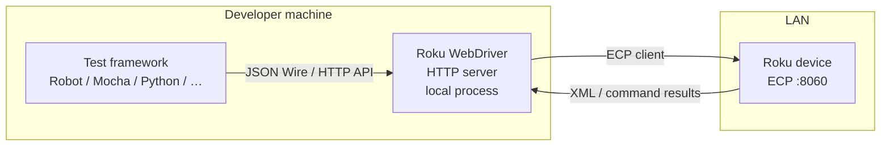

# Automated channel testing × Roku Dev Studio

Discussion note: how Roku’s **WebDriver**, **Robot Framework library**, and **JavaScript library** relate to the device and channel, what **this workspace already does**, and **concrete feature ideas** for Dev Studio—without committing to implementation.

**References**

- [Roku WebDriver](https://developer.roku.com/en-ca/docs/developer-program/dev-tools/automated-channel-testing/web-driver.md) (official; local `mcp_web_fetch` returned mostly shell HTML, so API specifics below are corroborated from the open-source client and README)
- [Robot Framework library](https://developer.roku.com/en-ca/docs/developer-program/dev-tools/automated-channel-testing/robot-framework-library.md)
- [JavaScript library](https://developer.roku.com/en-ca/docs/developer-program/dev-tools/automated-channel-testing/javascript-library.md)
- [rokudev/automated-channel-testing](https://github.com/rokudev/automated-channel-testing) (WebDriver binary, samples, Postman collection, Robot + JS libraries)

---

## How the pieces connect

### End-to-end data flow

1. **Test script** (Robot, JavaScript, Python, Go, etc.) does **not** talk to the Roku on `:8060` directly for WebDriver semantics. It sends HTTP requests to the **Roku WebDriver** process running on the developer machine (see [README overview](https://github.com/rokudev/automated-channel-testing/blob/master/README.md)).
2. **Roku WebDriver** exposes an HTTP API (documented as Selenium-related / JSON Wire style). It implements an **ECP client** and forwards the right **External Control Protocol** calls to the device IP you bind when creating a **session**.
3. The **device** executes ECP actions (launch, keypress, input, etc.) and returns data WebDriver needs; for UI state, WebDriver can obtain **SceneGraph-derived XML** so tests can assert on **elements** (tags, attributes, text).

### Roku JavaScript library (concrete behavior)

The published client in `jsLibrary/library/client.js` is illustrative:

- It targets a **local** WebDriver base URL (in-tree sample: `http://localhost:9000/v1/session`).
- On first request it **creates a session** with the **Roku IP**, timeout, and press delay; subsequent calls append the `sessionId` path segment.
- Higher-level helpers in `rokuLibrary.js` wrap that client: `launchTheChannel`, `sendKey` / `sendKeys` / `sendWord`, `getUiElement` / `getUiElements`, `verifyIsScreenLoaded`, `getPlayerInfo`, `verifyIsPlaybackStarted`, `sideLoad` (multipart to WebDriver), deep link via `sendInputData`, etc.

So: **JS library → HTTP → Roku WebDriver (localhost) → ECP → Roku**. The channel IP is a **session parameter**, not the HTTP host for WebDriver.

### Roku Robot Framework library

Same logical model: Robot **keywords** map to the same WebDriver HTTP API ([README](https://github.com/rokudev/automated-channel-testing/blob/master/README.md)). Tests still require the **WebDriver binary** path and device IP (CLI variables or `variables.py`). Multi-device runs use a `config.json` that lists device IPs, server path, test file, and output dir.

---

## What Roku Dev Studio does today (overlap and gaps)

Today the app and `roku-dev-studio-api` focus on **direct ECP** (`:8060`), **screenshots**, **sideload**, **telnet**, **RALE** (TrackerTask / TCP), **relay** remote control, and **action scripts**—not on bundling or driving **Roku WebDriver**.

| Capability | Typical path in automation stack | In this repo (high level) |
|------------|-----------------------------------|---------------------------|
| Device discovery, device-info | ECP / side features | Yes (`discovery`, `testConnection`, …) |
| Launch app, keypress, input, deep link | ECP (WebDriver uses ECP internally) | Yes (`ecp.js` / IPC) |
| Sideload / delete sideload | ECP / dev installer | Yes |
| Screenshot | Often separate from WebDriver | Yes (`screenshot` via API) |
| **Session-based WebDriver API** | Roku WebDriver HTTP server | **Not integrated** |
| **Element / screen XML assertions** | WebDriver element endpoints | **Not integrated** |
| **Player state** (`play` / position) via WebDriver | `/player` style endpoints | Partial overlap possible via ECP queries; WebDriver wraps this consistently |
| Multi-device orchestration in one runner | Robot/JS `multi` + config | Dev Studio has multi-device **UI** but not WebDriver test orchestration |

---

## Roku WebDriver API surface (from open-source client)

The following map to HTTP routes under the session (after `POST` create session with `ip`, `timeout`, `pressDelay`), as used by `jsLibrary/library/client.js`:

- Session: create, get (device info), delete  
- Launch / input (deep link–style payload)  
- Key: single press, sequence  
- Apps, current app  
- Player info  
- Screen source  
- Active element  
- Timeouts (implicit, press delay)  
- Install channel id  
- **Element** / **elements** (POST with locator payload)  
- Sideload: multipart **load**

Full authoritative list and request shapes belong in [web-driver.md](https://developer.roku.com/en-ca/docs/developer-program/dev-tools/automated-channel-testing/web-driver.md) and the **Postman collection** in the GitHub repo (`sample/Postman/WebDriver_endpoints`).

---

## What we could add to Roku Dev Studio (ideas)

Ordered from smaller integration surface to larger product bets.

1. **WebDriver lifecycle assistant**  
   - Detect or let the user point to `RokuWebDriver` (macOS / Windows / Linux binaries under `bin/` in the GitHub repo).  
   - Start/stop the process from Dev Studio, show listen port, surface “session created for IP …”.  
   - **Why:** Every official flow assumes this daemon is running; Dev Studio already knows device IPs.

2. **Embedded “smoke test” against WebDriver**  
   - Run a minimal subset (create session → query device-info or current app → delete session) using Node `fetch`/`axios`, same shape as `jsLibrary`’s `client.js`.  
   - **Why:** Validates firewall, binary arch, and ECP reachability in one click.

3. **Postman collection import or built-in API explorer**  
   - Import or duplicate the official Postman collection for quick manual calls.  
   - **Why:** Onboarding and debugging without leaving the IDE.

4. **First-class Node WebDriver client package**  
   - Either vendor a thin wrapper (similar to `jsLibrary`) inside `roku-dev-studio-api`, or document `yarn link` / subprocess to user’s clone.  
   - Enables **action scripts** or future “assert screen contains text X” steps **without** Python/Robot.

5. **Robot / Mocha runner panel**  
   - Configure `server_path`, `ip_address`, working directory; run `robot` or `mocha`, capture stdout and link to generated HTML reports.  
   - **Why:** Dev Studio becomes the control room for teams that already standardized on Robot or Mocha.

6. **Multi-device WebDriver matrix**  
   - UI to edit `config.json`-style device sets and run `multi.py` / `multi.js` equivalents, then open per-device reports.  
   - Complements existing multi-device connection UI.

7. **CI snippets**  
   - Generate GitHub Actions / generic shell that installs WebDriver binary, starts it, runs tests headless, tears down.  
   - **Why:** Certification and performance testing are called out in Roku’s README as motivators.

8. **Conceptual bridge: ECP-only vs WebDriver assertions**  
   - Today users can drive UI via ECP from Dev Studio but cannot assert SceneGraph the way WebDriver does. A doc panel or wizard could explain when to add WebDriver to the toolchain.

**Intentionally out of scope for a first discussion:** reimplementing the WebDriver server in Go/Node; that is Roku’s shipped binary in the open-source repo.

---

## Channel / app requirements (what has to be true on the Roku side)

From Roku’s published materials and the sample channel:

- **Roku OS 9.1+** for the automation stack ([README](https://github.com/rokudev/automated-channel-testing/blob/master/README.md)).  
- **Production channels:** packaging must align with the **same developer account** as production if you use automation against production builds.  
- **ECP** must be usable from the network context where WebDriver runs (same constraints Dev Studio already faces: permissive ECP, developer mode, etc.).  
- **UI automation / element APIs:** tests locate nodes using **tag**, **attribute**, or **text** (see `rokuLibrary.js` locator handling). Channels should expose **stable, testable SceneGraph structure**—e.g. meaningful labels/text and attributes—so `verifyIsScreenLoaded` and `getUiElement` are reliable. If a screen is built only from bitmaps or non-queryable nodes, WebDriver cannot assert on it.  
- **Sideload in tests:** sample flows call WebDriver’s **load** endpoint with channel zip + dev credentials—same conceptual operation as Dev Studio sideload, but through WebDriver’s multipart API.

**Separate from WebDriver:** Dev Studio **RALE** / inspector features require the channel to include **TrackerTask** and related dev integration. That is a different integration than WebDriver element queries.

---

## Live check (user-supplied device)

**Target:** `192.168.1.75`  
**Check:** `GET http://192.168.1.75:8060/query/device-info` from this environment.

**Result:** **Success (HTTP 200).** Example fields observed: model **Streaming Stick 4K (3820X)**, **software-version 15.2.4**, **ecp-setting-mode permissive**.  
**Not run:** Roku WebDriver binary was not started from this workspace, so **no WebDriver session** was created and **no** `/v1/session` calls were made. To validate WebDriver end-to-end, run the binary from [automated-channel-testing](https://github.com/rokudev/automated-channel-testing), then POST create session with this IP (e.g. via Postman or `jsLibrary`).

---

## Summary

- **Robot** and **JavaScript** libraries are **thin clients** over the **Roku WebDriver HTTP server**; WebDriver is the component that **owns the session** and **speaks ECP** to the TV/stick.  
- **Roku Dev Studio** already covers **direct ECP** and adjacent dev workflows; **WebDriver-based element assertions and session APIs** are the main **greenfield** integration area.  
- **Channel work** for meaningful automation is mostly **SceneGraph testability** (locators), OS/account prerequisites, and network/ECP—not a second “app server” on the device for WebDriver.

When this discussion graduates to implementation, consider splitting: (1) WebDriver process management + smoke test, (2) optional Node client + script steps, (3) test runner / CI affordances.
