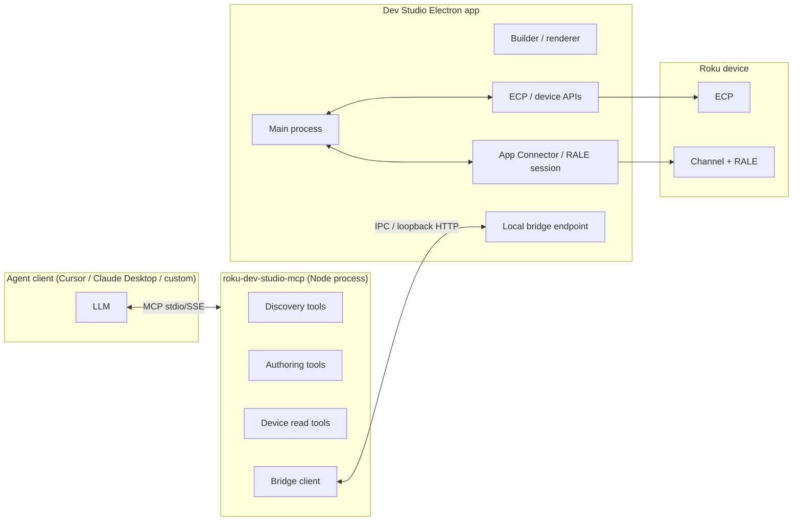
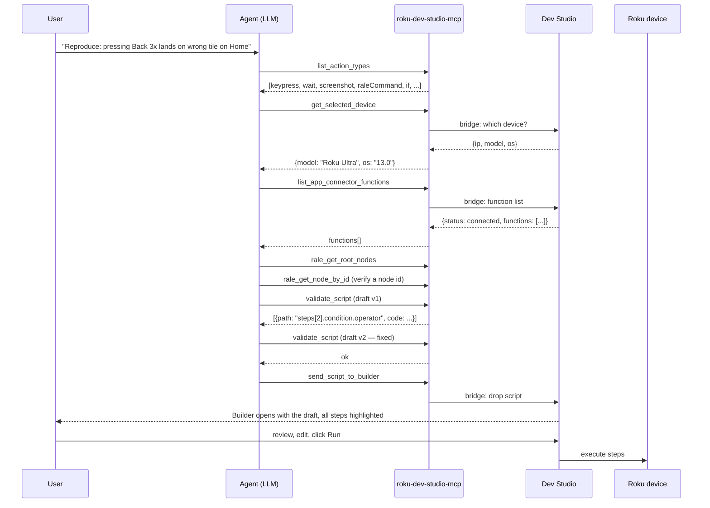

# MCP server for Action Scripts — design discussion

> Discussion doc. Original v1 design captured below; see **Status (2026-04)** for what shipped and where the design has since evolved.

## Status (2026-04)

The server shipped as `packages/roku-dev-studio-mcp` and has since grown **two surfaces**, not one. Treat the original v1 text (§3 onward) as a historical planning artifact and prefer this block when a section conflicts:

1. **Direct device ops** — one-shot tools driven by `roku-dev-studio-api/lib/operations.ALL_OPS`, auto-wired into the MCP tool catalog. Current ops: `keypress`, `launch_app`, `input_text`, `deep_link`, `ecp_query`, `ecp_post`, `rale_command`, `screenshot`, `sideload`, `delete_sideload`, `test_connection`, `scan_devices`, `get_app_icon`, `app_connector_connect`, `app_connector_disconnect`. Plus bespoke: `connect_device`, `rale_get_node_by_id`. Each does exactly one thing and returns immediately.
2. **Action Scripts** — the `validate_script` + `send_script_to_builder` flow this doc originally proposed. Unchanged in spirit: scripts land in Builder, never auto-run.

Picker rule (now embedded in `ACTION_SCRIPT_AGENT_CONTRACT`, the `initialize` instructions, `QUICK_START_MD`, and the `send_script_to_builder` / `validate_script` tool descriptions): single deterministic action → direct op; multi-step / conditional / polling / saved-or-reviewed flow → Action Script.

Other notable deltas from the original v1 scope:

- **Destructive direct tools now exist.** The original §3/§5.2 said "No write tools in v1" — that was true at the design stage but changed once `ALL_OPS` absorbed everything. `ecp_post`, `sideload`, `delete_sideload`, `rale_command`, and destructive screenshot flows are all exposed as direct tools today, each carrying `destructiveHint: true` so hosts can gate them at the tool-call layer. The human-review guarantee therefore now lives at **two levels**: (a) Builder review for Action Scripts (unchanged); (b) host-side consent on `destructiveHint` ops. That replaces the blanket "no writes" policy.
- **Discovery moved from tools to resources.** The per-vocabulary `list_*` / `describe_*` tools proposed in §5.1 were consolidated into MCP **resources** (`roku-dev-studio://quick-start.md`, `action-script-contract.md`, `capability-bundle.json`, `authoring-rules.json`) plus the `get_capability_bundle` tool. This keeps `tools/list` small and avoids dozens of vocabulary tools cluttering the agent's attention.
- **MCP prompts** now ship for the common workflows: `roku-one-shot-action`, `roku-action-script-quickstart`, `roku-debug-device`. Hosts with a prompt picker surface them to users directly.
- **Bridge transport** — Option A (loopback HTTP) from §4.2 is what shipped.
- **Agent-contract document** — the `ACTION_SCRIPT_AGENT_CONTRACT` string in `packages/roku-dev-studio-mcp/src/agent-contract.ts` is the canonical authoring prose; this design doc no longer tracks its contents.

---

Exploratory design for a **Roku Dev Studio MCP server** that exposes Action Scripts (and the per-device capability surface around them) to external AI agents (Cursor, Claude Desktop, Codex, custom clients). The agent uses the server to learn what actions are possible on the currently connected device, drafts an Action Script JSON, and hands it back to Dev Studio so the script appears live in the **Builder** for human review.

**Related notes (read these first; this doc avoids duplicating their content):**

- [ai-ticket-to-action-script.md](./ai-ticket-to-action-script.md) — §4 Option D, §6 context packaging, §6a Export-for-AI bundle, §8 safety guardrails. This MCP server is the implementation of Option D.
- [AI-ActionScript-Generator-NextSteps.md](./AI-ActionScript-Generator-NextSteps.md) — Phase 5 (MCP server) sequencing.
- [rale-builtins-action-scripts-integration.md](./rale-builtins-action-scripts-integration.md) — `raleCommand` step and built-in catalog the server advertises.
- [wait-node-field-condition.md](./wait-node-field-condition.md) — `wait`/`if` `rale-node-field` condition shape.
- [action-script-enhancements-design.md](./action-script-enhancements-design.md) — variables, `if`, version `"2"`.
- [cli-headless-mode-design.md](./cli-headless-mode-design.md) — headless run surface the MCP server can reuse for `dry_run` / `run` tools.

---

## 1. Goal

Let any MCP-capable AI agent answer the question **"given this user problem, what Action Script should I run on the connected device?"** and deliver that script straight into the Dev Studio Builder, with full knowledge of:

1. Every supported **Action (step type)** with its description.
2. Every **sub-option** for each action — keypress values, query/POST presets, wait/if condition sources, media-player states, active-app attributes, devicePerformance chart ids, `raleCommand` builtins and their arg shapes.
3. The connected device's **App Connector functions** (`getExternalControlFunctions`) when an App Connector session is live — names, params, types, and descriptions where the channel provides them.
4. **RALE node-field** assertions (the `rale-node-field` source for `wait` / `if`) — the operators, value shape, and live introspection of the current SceneGraph when the agent needs concrete `id`s or `field` names.

The agent is *not* expected to memorize the schema. It calls discovery tools at generation time. This is the **agentic-loop / tool-use** version of the AI flow described in `ai-ticket-to-action-script.md` §4 Option C, exposed as MCP instead of an in-app feature.

---

## 2. Why MCP (and not just an in-app button)

The in-app "Generate from ticket" feature (Option B in the AI ticket doc) is still on the roadmap. MCP is **complementary**, not a replacement:

| Surface | Owner | Strength |
|---|---|---|
| In-app panel (Option B) | Dev Studio | Zero setup for non-technical QA, branded UX, baked-in review gate. |
| **MCP server (Option D)** | Dev Studio exposes; agent client owns the loop | Power users stay in their existing IDE/agent; no model lock-in; multi-step reasoning; can be reused by CI agents. |

The two share **all** the underlying machinery — STEP_SCHEMA, validator, RALE catalog, App Connector enumeration, the "Export for AI" capability bundle from `ai-ticket-to-action-script.md` §6a. Building MCP first or in parallel costs roughly the same as Option B because the capability bundle is the hard part; transport is the easy part.

---

## 3. Scope

### In scope (v1)

- A standalone process **`roku-dev-studio-mcp`** that speaks MCP over stdio (and optionally HTTP/SSE).
- **Discovery tools** — schema, vocabularies, RALE built-ins, App Connector functions, currently selected device.
- **Authoring tools** — validate a draft script, send a script to Dev Studio's Builder.
- **Read-only device introspection** — query active app, list root SceneGraph nodes, fetch a node by id (so the agent can ground `wait`/`if` on real ids/fields without guessing).
- A small **bridge** between the MCP server process and the running Dev Studio Electron app so the server can read "what device is selected", "what App Connector functions exist", and push a generated script into the Builder.

### Out of scope (v1, deferred)

- **Auto-running** generated scripts. The agent never presses "Run". Same gate as the AI ticket doc §13.
- Multi-tenant authentication. v1 is **localhost only**, single Dev Studio instance.
- Writing to `/registry/...`, sideloading, deleting sideloads, or any destructive RALE command **directly from MCP tools**. Those steps can appear *inside* a generated script (the human still gates them in Builder), but the MCP server itself does not expose `sideload_file` or `clear_registry` as a tool.
- Streaming live device events to the agent (frame rate, perf charts, log telnet). Belongs in a later phase.
- Multimodal inputs (screenshots, video). Hooks designed for it; not implemented.

> **Update (2026-04):** The "no direct write tools" bullet above was reversed. `sideload`, `delete_sideload`, `ecp_post`, destructive `rale_command` subcommands, and `screenshot` are now exposed as first-class MCP tools (auto-generated from `roku-dev-studio-api/lib/operations.ALL_OPS`) and each carries MCP `destructiveHint: true`. The human-review guarantee moved from "writes live only in scripts" to "hosts gate destructive direct tools at call time, Builder still gates scripts." Screenshot capture is likewise a direct op now (not only a script step). Live log/perf streaming and multimodal remain deferred.

---

## 4. Architecture

Two processes, one bridge. The MCP server is **stateless** about device state — it always asks Dev Studio for the current snapshot. This avoids drift between "what the agent thinks is connected" and "what the user is actually pointing at in the UI".

### 4.1 Where the server lives in the repo

A new package: **`packages/roku-dev-studio-mcp`** (sibling of `roku-dev-studio-api`, `roku-dev-studio-remote-server`).

- Built with TypeScript, distributable as an npm package + an `npx roku-dev-studio-mcp` CLI for users who want to wire it into Cursor/Claude Desktop without installing the Electron app from source.
- Depends on `roku-dev-studio-api` for ECP, validation, and the canonical capability bundle helper (the helper proposed in `ai-ticket-to-action-script.md` §6a — building it is a prerequisite).
- Uses the official MCP SDK (`@modelcontextprotocol/sdk`) for transport.

### 4.2 Bridge between MCP server and the Electron app

The MCP server needs **live state** the static `roku-dev-studio-api` package doesn't have:

- The currently selected device IP and the currently active App Connector session (with its enumerated functions).
- The user's intent to "drop this script into Builder" — i.e., a writable channel back into the renderer.

Three viable transport choices for the bridge — pick one early, this decision propagates everywhere:

| Option | How | Pros | Cons |
|---|---|---|---|
| **A. Loopback HTTP server in Electron main** (recommended) | Main process listens on `127.0.0.1:<random>`, writes the port + an auth token to a well-known file in user-data dir. MCP server reads, posts JSON. | Simple. Works across processes/users. Same shape as `roku-dev-studio-remote-server`. Easy to test with curl. | Port management; need a kill switch when the app quits. |
| **B. Named pipe / Unix socket** | Electron main exposes a domain socket; MCP server connects. | No port; OS-enforced permissions. | Cross-platform churn (Windows named pipes ≠ Unix sockets). |
| **C. Electron-as-MCP-host** | Bake the MCP server *into* the main process; expose stdio via `electron --mcp` or a child PTY. | One process; no bridge. | Forces every MCP client to launch Electron just to talk to MCP. Non-starter for headless agents and CI. |

**Recommendation: Option A.** It mirrors the existing remote server's approach, keeps the MCP server runnable without launching Electron (useful for "schema-only" dry runs), and degrades cleanly when Dev Studio isn't open (live tools 503; static tools still work).

The bridge endpoint speaks a small JSON-RPC-ish protocol — it does **not** re-export every renderer API. It exposes only what the MCP tools need (see §5.4).

### 4.3 Headless mode

When the Electron app is not running, the MCP server still answers **static** discovery tools (STEP_SCHEMA, vocabularies, RALE built-ins) by loading `roku-dev-studio-api`'s capability bundle directly. Tools that require live device or App Connector data return a structured "no live session" error so the agent can fall back gracefully (e.g., emit a script that uses placeholder ids and warn the human).

---

## 5. Tool surface (v1)

Tool naming follows MCP convention: `verb_object`, snake_case. Each tool ships with a JSON schema for inputs and outputs, generated from the same TS types Dev Studio uses internally — single source of truth.

### 5.1 Discovery (static; no Electron required)

| Tool | Purpose | Output shape (sketch) |
|---|---|---|
| `list_action_types` | All step types (the **Actions**) with label and description from `STEP_SCHEMA`. | `[{ type, label, description, required[], optional[] }]` |
| `get_action_schema` | Per-type detail: required + optional fields with types, allowed values, examples. | `{ type, fields: [...], examples: [...] }` |
| `list_keypress_options` | Roku ECP keys, grouped (Navigation, Media). | `KEYPRESS_GROUPS` shape |
| `list_query_presets` / `list_post_presets` | ECP presets and labels. | `[{ endpoint, label }]` |
| `list_media_player_states` | `wait`/`if` `media-player` source vocabulary. | `MEDIA_PLAYER_STATES` |
| `list_active_app_attributes` | `if` `active-app` source vocabulary. | `ACTIVE_APP_IF_ATTRIBUTES` |
| `list_device_performance_charts` | `devicePerformance.chart` ids. | `DEVICE_PERFORMANCE_CHART_IDS` |
| `list_wait_sources` / `list_if_sources` | Allowed condition source strings. | string[] |
| `describe_rale_node_field_operators` | Operators + which require a `value` (`is`, `contains`, `hasAnyValue`, …) per `wait-node-field-condition.md`. | `[{ operator, requiresValue, description }]` |
| `list_rale_builtins` | Built-in RALE commands (`getNodeById`, registry helpers, …) with arg schemas and labels. | derived from `RALE_BUILTIN_COMMANDS` + `rale-command-args.ts` |
| `get_capability_bundle` | The full **Export for AI** bundle (`ai-ticket-to-action-script.md` §6a) in one call. | the canonical JSON described there |
| `get_authoring_rules` | Hard rules from §6 of the AI ticket doc (version 2 required for `if`, no passwords in JSON, prefer `wait` over `delayMs`, …). | `[{ id, rule, rationale }]` |

These exist **without** any device connected. The point is: an agent can plan offline, then ask the live tools for the bits it can't guess.

### 5.2 Live device & App Connector (requires Electron)

| Tool | Purpose | Notes |
|---|---|---|
| `get_selected_device` | IP, model, OS version, friendly name of the device currently selected in Dev Studio. | 503 if no device selected. |
| `list_app_connector_functions` | App Connector–registered functions for the currently active channel — names, params, types. Pulled from the same `getExternalControlFunctions` cache the Builder uses. | Returns `{ status: "connected" | "available-not-connected" | "not-applicable", functions, fetchedAt }` exactly like the export bundle. **Never silently empty** — always one of three statuses. |
| `get_app_connector_function_signature` | Detail for one function (params, types, optional description). | Same shape as Builder's signature card. |
| `query_active_app` | `/query/active-app` JSON. | Lets the agent reason about whether to launch first. |
| `query_device_info` | `/query/device-info` JSON. | Model + OS for context-aware scripts. |
| `list_apps` | `/query/apps` JSON. | App ID grounding. |
| `rale_get_root_nodes` | List of root SceneGraph nodes (names + types). | Used by the agent to disambiguate before writing `getNodeById`. Requires App Connector. |
| `rale_get_node_by_id` | Single `getNodeById` call passthrough — agent provides `path` + `id`. | Read-only; same args as the `raleCommand` step. Lets the agent verify a node exists and inspect its `fieldlist` before emitting `wait`/`if` `rale-node-field`. |

**No write tools** in v1. `rale_set_field`, `rale_clear_registry`, `device_sideload` are deliberately absent. If an agent wants to change device state, it must do so by emitting a step in the generated script, which then goes through the Builder's existing destructive-step warnings (see `ai-ticket-to-action-script.md` §8).

> **Update (2026-04):** Superseded. Direct write tools now exist — `sideload`, `delete_sideload`, `ecp_post`, `rale_command` (including destructive built-ins), `launch_app`, `deep_link`, `keypress`, `input_text`, `screenshot`. Each is flagged with MCP `destructiveHint: true` / `readOnlyHint: false` so agent hosts (Cursor, Claude Desktop, etc.) gate them with their own per-tool consent UI. This is *additive* to Builder review: scripts still land in Builder untouched, and single-action mutations now have a short-circuit path that does not require authoring a one-step script.

### 5.3 Authoring & handoff

| Tool | Purpose |
|---|---|
| `validate_script` | Runs `parseAndValidateScript` from `roku-dev-studio-api` and returns **structured** errors `[{ path, code, message, expected? }]` (the structured-validator-output dependency from the AI ticket doc §9). The agent uses this in a self-correction loop. |
| `dry_run_script` | (Stretch v1) Static analysis only: lists every POST, sideload, RALE write that would be performed, plus the resolved app launch order. Does **not** touch the device. |
| `send_script_to_builder` | Pushes the script into the live Dev Studio Builder. Opens the Action Scripts tab if needed, replaces / appends to the current draft, scrolls to first step. **The user always reviews; nothing runs.** Returns `{ openedInBuilder: true, scriptId, warnings[] }`. |
| `get_current_builder_script` | (Optional) Reads back the Builder's current in-progress script so the agent can iterate / refine instead of overwriting. Default: **off**, opt-in per session, because it crosses from "describe the tool" to "describe this session" (privacy note in §6a of the ticket doc). |

### 5.4 Bridge endpoints (Electron main)

The bridge is an internal contract; it is *not* an MCP tool surface. It exposes just what §5.2 and §5.3 need:

- `GET /bridge/selected-device`
- `GET /bridge/app-connector/functions`
- `POST /bridge/rale` (`{ command, args }` — proxied to the live RALE session, **read-only allowlist**)
- `GET /bridge/ecp` (`?endpoint=/query/...`)
- `POST /bridge/builder/script` (`{ script }` — drops it into Builder)

Everything is gated by the per-launch auth token.

---

## 6. End-to-end flow

Critical properties:

1. The agent **plans against discovery tools** (cheap, stateless) before it commits.
2. The agent **self-corrects via `validate_script`** before handoff. The same loop the in-app Option B would have, just driven from outside.
3. The handoff (`send_script_to_builder`) lands in the **existing Builder** — no parallel UI surface, no auto-run path. The human review gate in `ai-ticket-to-action-script.md` §13 is preserved by construction.

---

## 7. Discovery: how each Action's "sub-options" surface

The user's original requirement: *"provide sub options available for each Action — all possible options of each Action should be available."* Concretely, the MCP server resolves "sub-options" per action type as follows:

| Action | Sub-option source | MCP tool the agent calls |
|---|---|---|
| `keypress` | `KEYPRESS_GROUPS` | `list_keypress_options` |
| `query` | `QUERY_PRESETS` + free-form | `list_query_presets` |
| `post` | `POST_PRESETS` + free-form | `list_post_presets` |
| `launch` | App ids from `/query/apps` | `list_apps` |
| `sideload` / `deleteSideload` | File path (user-supplied), password placeholder rule | `get_authoring_rules` |
| `appFunction` | **Live** App Connector functions for current channel | `list_app_connector_functions` + `get_app_connector_function_signature` |
| `raleCommand` | `RALE_BUILTIN_COMMANDS` + arg shapes | `list_rale_builtins` |
| `wait` (delay) | numeric `delayMs`/`timeoutMs`/`pollIntervalMs` | `get_action_schema` |
| `wait` (condition) | `WAIT_SOURCES` → media-player states OR rale-node-field operators | `list_wait_sources`, `list_media_player_states`, `describe_rale_node_field_operators`, `rale_get_node_by_id` (to ground `id`/`field`) |
| `if` | `IF_SOURCES` (adds `active-app`, `variables`) | `list_if_sources`, `list_active_app_attributes` |
| `screenshot` | label / waitBefore / waitAfterTrigger | `get_action_schema` |
| `devicePerformance` | `DEVICE_PERFORMANCE_CHART_IDS` | `list_device_performance_charts` |
| `inputText` | free-form text | `get_action_schema` |

For an agent that wants the whole picture in one shot, `get_capability_bundle` returns the canonical JSON document defined in `ai-ticket-to-action-script.md` §6a — same artifact the in-app "Export for AI" button will produce. **The MCP server is the programmatic mouth of that bundle.**

This means we should build the bundle helper in `roku-dev-studio-api` *first*, then the MCP server is a thin wrapper. Trying to build them in the opposite order leads to drift.

---

## 8. RALE / App Connector specifics

The user called out RALE Node Field and App Functions explicitly. Two things matter here:

### 8.1 App Connector functions

- The renderer already fetches them on tab open (`fetchRaleFunctionsForBuilder` / `builderApi.setRaleFunctions`).
- The bridge exposes that cache plus a "refresh now" path (matching the proposed export-button refresh semantics in §6a of the ticket doc).
- **Status discipline:** `connected | available-not-connected | not-applicable`. The agent should prefer real signatures when present; when not connected, it can still emit `appFunction` steps with a placeholder and the bundle's status note tells it to add a comment ("verify function name after connecting App Connector").
- **Open question:** Should we lobby App Connector to start returning optional `description` strings per function? (Already an open question in the AI ticket doc §6a; restated here because MCP makes the value of those descriptions much higher — the agent can read them and pick smarter.)

### 8.2 RALE node-field condition

- Static side: `describe_rale_node_field_operators` returns the operators table from `wait-node-field-condition.md` (`is`, `isNot`, `hasAnyValue`, `hasNoValue`, `contains`, `doesNotContain`, `beginsWith`, `endsWith`) plus the `caseInsensitive` flag, with structured `requiresValue` so the agent doesn't emit a stray `value` field on `hasAnyValue`.
- Live side: `rale_get_node_by_id` lets the agent **verify** a `path` + `id` resolves and inspect the node's `fieldlist` before deciding which `field` to assert on. This is the "huge reliability win" Option C is supposed to enable in the AI ticket doc §4.
- The MCP server **never writes** a node field. Agent writes go through emitted `raleCommand` steps in the script (and v1's `RALE_BUILTIN_COMMANDS` does not include node-update commands anyway — see `rale-builtins-action-scripts-integration.md` §"Relationship to node update").

---

## 9. Handoff to Builder

`send_script_to_builder` is the linchpin of the whole feature — it's what makes the agent's output actually useful in the existing tool. The bridge accepts a draft script and the Builder:

1. Validates again on the renderer side using the same `parseAndValidateScript` (defense in depth — the MCP server already validated, but the renderer is the source of truth).
2. **Opens the Action Scripts tab** if not already focused.
3. Replaces the current Builder draft (with an undo stack entry) — or, if `mode: "append"` is requested, appends to the current draft.
4. Tags the script with provenance metadata (the `metadata.generated_by: "mcp"`, `metadata.agent`, `metadata.tool_calls[]` block flagged as a dependency in `ai-ticket-to-action-script.md` §9). Persisting this is a small validator change; v1 can store it loosely if validator strictness is a problem.
5. Highlights destructive steps (`sideload`, `deleteSideload`, `clearRegistry`, etc.) with a banner per `ai-ticket-to-action-script.md` §8.
6. **Never runs.** The user is the trigger.

Open question: what do we do if the user already has unsaved Builder changes when MCP tries to drop a script in? Three options:

1. **Block** — return an error like "user has unsaved work; ask user to save or discard first".
2. **Stash** — auto-save the current draft into a `mcp-incoming/` slot and switch.
3. **Diff modal** — show a side-by-side and let the user merge.

Preference: **stash** for v1 (least surprising; non-destructive). Diff modal is the long-term answer.

---

## 10. Security & guardrails

The MCP server is **localhost-only** and bound to a per-launch token, but agents are not always trustworthy. Layer the same guardrails the in-app flow gets, plus a couple specific to MCP:

- **Token rotation:** the bridge token rotates on every Dev Studio launch and is written to `~/Library/Application Support/Roku Dev Studio/mcp-token` (or platform equivalent) with `0600` perms. MCP server reads it; nothing else sees it.
- **No MCP write tools** for destructive operations (see §5.2). All destructive surface comes through the script's own steps, which Builder gates.
- **Rate limit** discovery and live tools so a runaway agent can't melt the device with `getNodeById` polls. The same `pollIntervalMs` floor the executor uses applies here.
- **Audit log:** every MCP tool call is appended to a per-session log (tool name, args summary, timestamp) viewable in Dev Studio's diagnostics. Helps trace "the agent did *what*?".
- **Secret hygiene:** `validate_script` rejects scripts containing literal `password`/`devPassword` values in v1 (per `ai-ticket-to-action-script.md` §8). Agent must use placeholders. (Implies the placeholder feature in the AI ticket doc §9.5 is a soft prerequisite — usable without it but with worse UX.)
- **Off switch:** Settings → "Allow MCP server" toggle, default **off**. Disabled means no bridge port; turning it on regenerates the token.
- **Visibility:** while MCP is enabled, a small persistent indicator appears in the Dev Studio status bar with last-seen-tool and a "Disconnect" button. Users should never wonder whether an external agent is listening.

---

## 11. Dependencies (mostly already on the roadmap)

Most of these are already flagged in `ai-ticket-to-action-script.md` §9 — restated here because the MCP server makes them harder to defer:

1. **Capability bundle helper in `roku-dev-studio-api`** — single source of truth for the JSON the MCP server (and the in-app "Export for AI" button) returns. **Hard prerequisite.**
2. **Structured validator errors** — `parseAndValidateScript` returns `{path, code, message, expected?}[]`. Critical for agent self-correction; without it, error feedback to the model is garbage. **Hard prerequisite.**
3. **Provenance metadata block** tolerated by the validator. **Soft prerequisite** (v1 can ship without; quality of life later).
4. **Password placeholder resolution** at executor time. **Soft prerequisite** (v1 can require humans to fill them in Builder before running).
5. **Builder API for "drop a script in"** — most of the wiring exists (Import modal, paste-to-builder); we just expose it through the bridge. **Small additive change.**
6. **Bridge transport choice** (Option A from §4.2) — needs a couple of days to get right (port allocation, token, lifecycle).
7. **MCP SDK upgrade discipline** — the MCP spec is moving; pin a known-good `@modelcontextprotocol/sdk` and upgrade deliberately.

---

## 12. Phasing

Aligned with the existing AI roadmap so this lands without re-doing context work:

| Phase | Scope | Outcome |
|---|---|---|
| **0** | Capability bundle helper + structured validator errors. | Two prerequisites done. Both unblock Option B *and* this MCP server. |
| **1** | MCP server skeleton + static discovery tools (§5.1). | An agent can fully describe Action Scripts without Dev Studio running. Useful immediately for prompt-context generation. |
| **2** | Bridge transport (Option A) + live discovery (§5.2 read-only) + `validate_script`. | Agents can ground on the actual connected device. |
| **3** | `send_script_to_builder`. | Closes the loop — agent → Builder → human → run. |
| **4** | `dry_run_script`, `get_current_builder_script` (opt-in), provenance metadata, audit log surfacing. | Production-grade. |
| **5** | (Stretch) Optional write tools behind explicit per-call human consent (e.g., a Dev Studio modal "Agent wants to call `clearRegistry` on device X — Allow / Deny"). | Only if real demand emerges; otherwise leave writes to script steps. |

Phases 0–3 give a usable end-to-end story. Phase 4 hardens it.

---

## 13. Open questions

- **Single Dev Studio instance?** Bridge token is per-launch; if a user runs two Dev Studio instances, which one does the MCP server bind to? Probably "the most recent launch wins" with a warning; multi-instance is uncommon.
- **Cross-machine?** A QA on machine B wants to use the Roku connected to machine A. v1 says no. v2 could ride on the existing `roku-dev-studio-remote-server` to make this work.
- **Per-agent permissions?** Should we let users mark certain tools (e.g., live RALE introspection) as "ask first"? Adds friction; defer until a real complaint exists.
- **Tool naming stability.** Once an agent author hardcodes `list_action_types`, renaming it is a breaking change. Lock names down in v1 and never rename — only add.
- **Output schemas.** MCP encourages but does not require structured tool outputs. We should ship JSON schemas from day 1 so agent clients with type-aware UIs (Cursor) can render them.
- **Agent-side caching.** Agents will probably cache `get_capability_bundle`. Should we expose a `bundleVersion` (hash of the canonical JSON) so agents know to re-fetch when Dev Studio updates? Cheap to add; do it.
- **Should `send_script_to_builder` require a human prompt confirmation in Dev Studio** (modal: "Agent wants to drop a 14-step script — Accept / Reject")? Tradeoff: friction vs. surprise. Lean toward modal in v1 because it's the first time an outside process can write into the user's Builder.
- **Discovery for `version: "2"` scripts.** Should `list_action_types` advertise `if` only when the agent declares its target version? Probably no — always advertise; the validator enforces version.

---

## 14. Non-goals (explicit)

- Replacing the in-app AI flow (Option B). Both can ship; they share infrastructure.
- Letting an external agent run scripts unattended. Always Builder-gated.
- Becoming a generic Roku MCP server (e.g., for non-Dev-Studio use cases). Scope is tightly Action-Script-shaped; if a generic ECP MCP makes sense later, fork it from this one.
- Embedding model logic in Dev Studio. The MCP server has no opinion on which model is calling it.

> **Update (2026-04):** The "Always Builder-gated" non-goal applies specifically to **Action Scripts**. Direct ops (`keypress`, `launch_app`, `rale_command`, `ecp_post`, `sideload`, …) can and do run without Builder; their gate is the host-side `destructiveHint` consent prompt plus the bridge's per-launch token. The "tightly Action-Script-shaped scope" bullet is partially obsolete — the surface today is *both* direct ops *and* Action Scripts, intentionally. The fork-to-a-generic-ECP-MCP path is therefore no longer needed; this server already is the superset.

---

## 15. Decision log (to fill in)

| Topic | Decision | Date |
|---|---|---|
| Package location (`packages/roku-dev-studio-mcp`) | TBD | |
| Bridge transport (loopback HTTP vs socket) | Leaning A — loopback HTTP | |
| MCP server runs standalone (no Electron required) for static tools | TBD — recommended yes | |
| Default for "Allow MCP server" setting | Off | |
| Stash vs block vs diff on `send_script_to_builder` with dirty Builder | Leaning stash for v1 | |
| Provenance metadata block in scripts | Required eventually; not a v1 blocker | |
| Tool name stability policy | Add-only; never rename | |
| Audit log surfacing in Dev Studio | Phase 4 | |

---

*Status: discussion / design proposal. No implementation planned in this doc — see §11 prerequisites and the linked notes for sequencing.*
