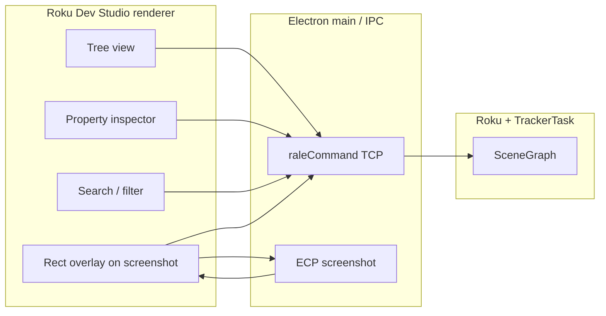

# Design: SceneGraph / RALE visualization (tree, inspector, search, highlight)

## Summary

Extend Roku Dev Studio beyond **ad hoc** node lookup (`getNodeById` / `getNodeByName` from the inspector) with a cohesive **live SceneGraph explorer**: collapsible tree, real-time properties, search/filter, and optional **highlight-on-screenshot** using each node’s **bounding rectangle**. This note scopes goals, maps them to existing RALE surfaces in `TrackerTask.xml`, and calls out protocol, UX, and coordinate-system gaps.

## Goals

1. **Visual tree explorer** — Collapsible hierarchy rooted at the scene (or a chosen subtree), driven by device state, not static XML.
2. **Live property inspector** — Selecting a tree node shows fields that **refresh** as the app runs (within practical rate limits).
3. **Node search / filter** — Find nodes by **subtype** (class), **id**, or **field value** (exact or substring, TBD), scoped to a subtree.
4. **Highlight on device** — When a node is selected, draw its **bounding rect** on top of a **live screenshot** (or a dedicated overlay channel), so developers can see *where* the node is on screen.

Non-goals for an initial slice (unless explicitly pulled in later): editing the tree structure (reparent nodes), visual layout editors, or pixel-perfect compositor debugging beyond bounding boxes.

## Current state (repo)

| Capability | RALE command(s) | Notes |
|------------|-----------------|--------|
| Path-scoped subtree | `path` JSON array; `[]` = scene root | Same as `RALE_getNodeByPath` in `TrackerTask.xml`. |
| Node by `id` | `getNodeById` | Depth-first, first match; returns `getNodeData`-style payload + `path`. |
| Node by subtype | `getNodeByName` | `name` is `node.subtype()` (e.g. `Label`, `RowList`). |
| Children + fields at a path | `getItemList` | Good for **lazy** tree expansion. |
| Nested hierarchy snapshot | `getNodeTree` | `path`, `maxLevel` — good for prefetch or “expand one level”. |
| Single node detail | `getNodeData` | Full detail for the inspector panel. |

Studio already exposes **Get Node by ID** and **Get Node by SubType** as RALE builtins in the inspector (`rale-builtins.js`, `function-execution.js`). There is no first-class **tree UI** or **polling** loop wired to `getItemList` / `getNodeTree` / `getNodeData` yet.

On device, `TrackerTask.xml` already reads **`node.boundingRect`** (e.g. selector overlay logic). That establishes feasibility for returning rect metadata over RALE if the command surface is extended or reused.

## Architecture (high level)

- **Tree + inspector + search** are primarily **RALE round-trips** on the existing socket (same path as `raleCommand` today).
- **Screenshot highlight** combines **ECP screenshot** (already used for Remote tab / auto-screenshot) with **geometry from the device** for the selected path.

## 1. Visual tree explorer

### UX

- Left (or dedicated) panel: **root** = scene or last-used path; rows show **subtype**, **id** (if any), and optional **summary** (e.g. first line of `text` for `Label`).
- **Expand** loads children; **collapse** keeps cached children until explicit refresh or invalidation.
- Toolbar: **Refresh**, optional **depth limit** (mirror `getNodeTree` `maxLevel`), **follow focus** (future: jump to node under focus).

### Data strategy

| Approach | Command | Pros | Cons |
|----------|---------|------|------|
| Lazy children | `getItemList` per expanded node | Small payloads; matches large trees | Many round-trips if user expands fast |
| Prefetch subtree | `getNodeTree` with small `maxLevel` | Fewer trips for shallow trees | Large JSON for deep/wide scenes |

**Recommendation:** Default to **lazy `getItemList`**; optional “Load 2 levels” using `getNodeTree` for faster first paint when the scene is small.

### Open points

- **Stability of path indices** while the tree mutates: if children are inserted/removed, path arrays can become stale. The UI should treat **path as a hint**, recover with **re-search by id** when a command returns invalid path, and/or show a “stale” banner after failed refresh.
- **Virtualization** for very wide lists (e.g. `RowList` items) — may require server-side caps or “show first N children + More…”.

## 2. Live property inspector

### UX

- Selecting a node sets **current path** (and caches **id** / **subtype** for display).
- Inspector shows **fields** from `getNodeData` in a **key–value** table; values update on an interval or on **manual Refresh** when the user toggles **Live**.
- **Live** mode: poll at a conservative rate (e.g. 2–5 Hz) or only while the SceneGraph panel is focused, to avoid saturating the RALE channel and UI thread on device.

### Implementation sketch

- Reuse formatting patterns from existing inspector responses (`node-lookup.js`, RALE response formatting) where possible.
- **Diff** successive payloads to avoid flicker; highlight cells that changed (subtle) for debugging.

### Risks

- Some fields are expensive or volatile; **exclude** internal/large fields by default if `getNodeData` returns them (product decision per field type).

## 3. Node search / filter

### User-facing behavior

- **Filter bar** while browsing: narrow visible tree by substring on **id** or **subtype** (client-side if the subtree is already loaded).
- **Global search** under a path: user enters query + mode (**subtype**, **id**, **field name = value**, etc.); results are a **flat list** of paths with jump-to / expand-parents.

### Protocol options

| Option | Description | Tradeoff |
|--------|-------------|----------|
| A. Client walk | Repeated `getItemList` / `getNodeTree` BFS from root | No BrightScript change; slow on huge scenes |
| B. New RALE command | e.g. `searchNodes` with `{ path, criteria }` implemented in `TrackerTask.xml` | Fast, one round-trip; requires app update / component ship |
| C. Hybrid | Client search with **max nodes** and **timeout**; suggest server search when limit hit | Balanced MVP |

**Recommendation:** Ship **A or C** for MVP in tooling-only releases; add **B** if search latency or accuracy is insufficient.

**Note:** `getNodeById` / `getNodeByName` already implement **depth-first first match** — good for “jump to first Label” but not for listing **all** matches; global search needs iteration or a dedicated command.

## 4. Highlight on device (bounding rect on screenshot)

### Desired behavior

- User selects node → Studio fetches **rectangle in scene coordinates** → draws **semi-transparent overlay** on the latest screenshot image in the UI.

### Getting the rectangle

- **Preferred:** RALE returns **`boundingRect`** (and optionally `translation` / parent chain) for the node at `path`, aligned with existing BrightScript usage in `TrackerTask.xml` (`node.boundingRect`).
- If `boundingRect` is invalid for some node types, UI shows **“No bounds”** instead of a wrong box.

### Coordinate mapping

Screenshots are typically **full framebuffer** images; SceneGraph **`boundingRect`** is in **scene / design resolution** space. Overlay must account for:

- **Resolution** vs **safe zone** / **overscan** if the capture path letterboxes or scales.
- **Aspect** differences between design resolution and captured image.

**Recommendation:** Document a single **mapping contract**: e.g. scale uniform + offset derived from known capture dimensions vs `ui_resolution` from device info, with a **calibration fallback** (user nudge) only if needed.

### Refresh coupling

- **Option 1:** On each screenshot refresh, re-fetch rect (or cache rect timestamped with last tree selection).
- **Option 2:** **Double capture** — screenshot + rect in one logical “frame” (harder without protocol support).

For MVP, **rect poll at low rate** + **screenshot on demand / existing auto-screenshot** is enough; perfect sync is not required for debugging.

## Phasing (suggested)

| Phase | Deliverable |
|-------|-------------|
| **P0** | Read-only tree (lazy `getItemList`) + static inspector (`getNodeData` on select) + manual refresh |
| **P1** | Live inspector (throttled poll) + client-side filter on loaded nodes |
| **P2** | Rect overlay on screenshot + mapping rules |
| **P3** | Global search (client BFS or RALE `searchNodes`) + polish (virtualization, stale path recovery) |

## Risks and constraints

- **RALE throughput:** Tree + live inspector can dominate the socket; use **batching**, **throttling**, and **cancel in-flight** when selection changes quickly.
- **Threading:** All commands must stay on the UI thread semantics already assumed by `TrackerTask` handlers.
- **Security / privacy:** Field values may contain PII; no change to logging defaults without review.

## Open questions

1. Should **field value search** be exact, substring, or regex — and should it be **opt-in** (slow)?
2. Is **boundingRect** sufficient for all target node kinds, or do we need **Group** / **layout** hints?
3. Should tree expansion **auto-scroll** to the node affected by the last ECP keypress / focus (requires new signals from app or heuristics)?

## References

- `roku-components/TrackerTask.xml` — `UIThread_getItemList`, `UIThread_getNodeTree`, `UIThread_getNodeData`, `UIThread_getNodeById`, `UIThread_getNodeByName`; `boundingRect` usage in selector view.
- `.discussion-docs/rale-node-lookup.md` — shipped lookup UX and RALE mapping.
- `apps/roku-dev-studio/renderer/components/inspector/rale-builtins.js` — current RALE builtins registry.
- `packages/roku-dev-studio-api/` — screenshot and device info primitives for overlay calibration.
