# Features

[← Back to README](README.md)

### 🎮 Remote Control
- **Full D-Pad Control:** Navigate menus, select items, go back/home
- **Media Controls:** Play, pause, rewind, fast-forward, volume control
- **Optional Keyboard Remote:** Enable in **Settings → General → Roku Remote - Use Keyboard** (off by default); then arrow keys, Enter, Backspace, Escape, Space, etc. work as the remote on the **Remote** tab (solo layout or device-performance quad) or **Dev App** tab for the open device, not in other UI.
- **Visual Remote Interface:** On-screen remote with all buttons
- **Works Locally & Remotely:** Control devices on local network or via remote server
- **Floating Remote:** A draggable mini remote you can pop open on any tab that doesn't already show a full remote (e.g. Query, App Connector), so D-pad control stays one click away while you work elsewhere
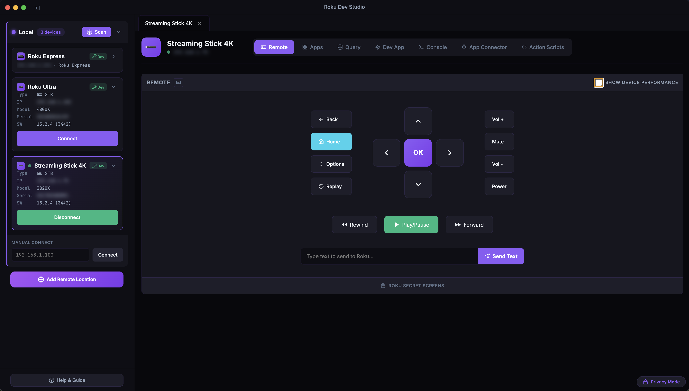

### 📊 Device Performance (Remote Section)
- **Live charts:** On **Remote**, turn on **Show Device Performance** for a quad layout with **CPU**, **memory**, and **object** charts (count or memory view where available).
- **When it applies:** Charts reflect the running app when the device has **Developer Mode** on and your **sideloaded dev channel** is in the foreground.
- **Settings → Device Performance:** Tune chart **sample interval** and **history** window; optional **Remember 'Show Device Performance'** restores whether the quad was on **per device** between sessions.
- **Action Scripts:** Add **Device Performance** steps to capture chart cards into run results (for example PNGs included when you export results to PDF).

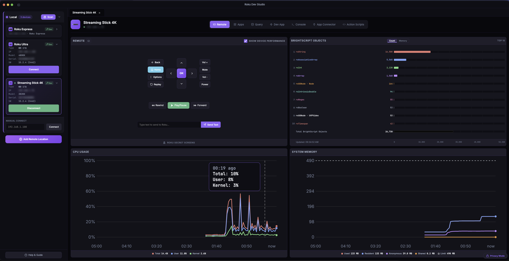

### 🔍 Device Discovery
- **Automatic SSDP Discovery:** Automatically finds Roku devices on your local network
- **Subnet Scanning:** Fallback discovery method when SSDP multicast is unavailable
- **Remote Device Discovery:** Discover devices on remote networks via server bridge
- **Real-time Updates:** Devices appear as they're discovered

### 📱 App Launcher & Management
- **Installed Apps Browser:** View and launch all apps installed on the device
- **App Icons:** Display actual app icons loaded from the device in a grid layout
- **Custom App Launch:** Launch any app by entering App ID
- **Deep-Linking:** Launch apps with specific content (movies, shows, channels)
- **HDMI Inputs:** Switch to HDMI inputs on TV devices
- **Remote Launch:** Launch apps on remote devices via server
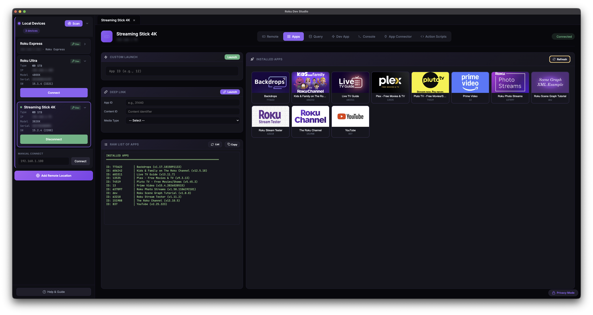

### 🔬 Device Queries
- **Device Info:** Get device name, model, serial, software version, network info
- **All Apps:** List all installed apps with details
- **Active App:** Get currently running app information
- **Media Player:** Query current media playback status
- **SceneGraph Nodes:** Query all nodes or root nodes
- **SG Rendezvous:** Get SceneGraph events and track/untrack
- **FW Beacons:** Query firmware beacons
- **Plugins & Memory:** Get plugin info and memory usage
- **System Commands:** Execute system-level commands via telnet (port 8080)
- **Command History:** View and re-run previous commands
- **Custom Queries:** Run any custom ECP query endpoint
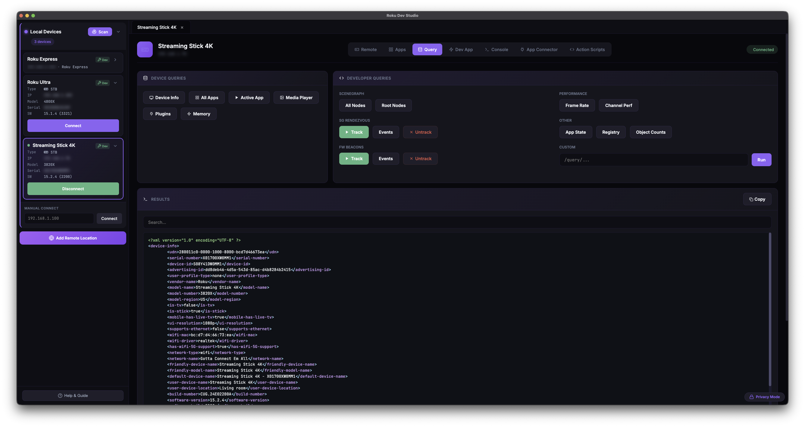

### ⚡ Dev App Management
- **Remote Sideloading:** Upload and install dev channels to local or remote devices
- **Auto Screenshot:** Automatically capture screenshots after keypresses, text input, and Dev App Launch (when enabled)
- **Launch Dev App:** Launch sideloaded dev channel with one click
- **Delete Sideload:** Remove sideloaded channel remotely
- **Dev App Status:** View currently sideloaded app information
- **Progress Tracking:** Real-time upload progress for sideloading
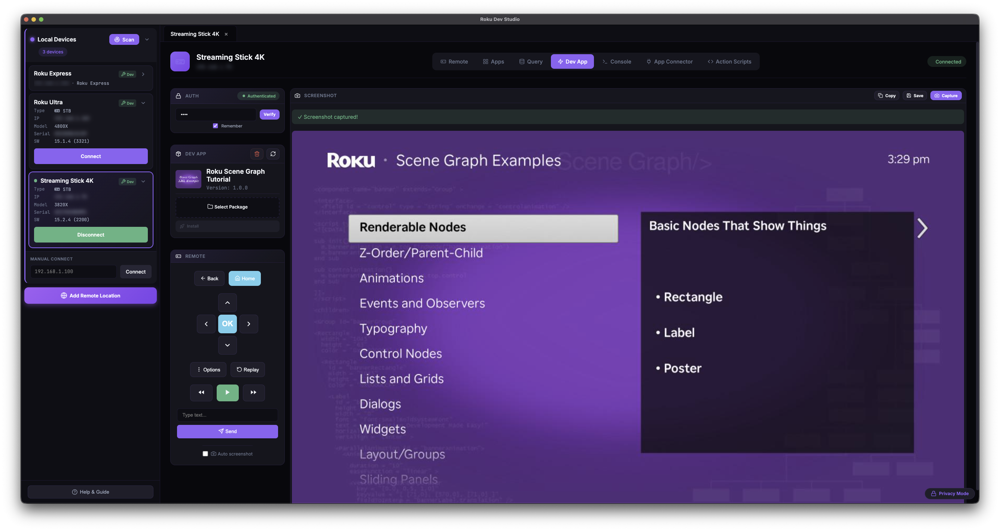

### 🎬 Try Demo App
- **No channel of your own required:** Sideload the bundled **Roku Dev Studio Showcase** channel to any Roku in Developer Mode. It exercises Remote Control, App Connector (real two-way function calls), Network Inspector traffic, Console Monitor findings, and MCP/AI-agent control, so you can explore RDS without building a channel of your own
- **One-click sideload:** Enable **Show Try Demo App Button** in **Settings → General** to add a title-bar button; pick a developer-mode device in the picker and RDS packages, sideloads, and launches it
- **Guided callouts:** A post-launch tips list points you at the exact App Connector functions (`PlayContentById`, `SetProxy`, `TriggerConsoleFinding`, and more) that light up each feature

### 📡 Sideload Relay
- **One build → many devices:** With the relay on, Roku Dev Studio advertises itself as a Roku over SSDP; point your IDE (VS Code BrightScript / Eclipse / roku-deploy) or a browser at this machine, upload once, and RDS fans the build out (install → launch → console) to every targeted device — local or at a remote location
- **Enable in Settings → Sideload Relay** (off by default): set a **Relay Dev Password** (how your IDE authenticates to RDS) and pick targets in **Setup Devices**
- **Browser upload page:** A themed drag-and-drop `.zip` uploader is served at the relay address for sideloads without an IDE
- **Auto-connect:** Each device that receives a build opens as a connected tab with its debug console attached; live fan-out progress streams on telnet `8085`
- **Source approval:** A sideload from another machine prompts for allow / deny on the RDS host; remote browser uploads also require the Relay Dev Password

### 💻 Console & Debugging
- **Telnet Console Access:** Direct access to Roku console logs (port 8085)
- **Remote Console:** Access console logs on remote devices via server
- **Real-time Output:** See console log output in real-time
- **System Commands:** Execute system commands via telnet (port 8080)
- **Log Export:** Save console logs to file

### 🩺 Console Monitor
- **Automatic BrightScript issue detection:** Scans console output for recognized crash / error patterns and lists them with **What / Cause / Fix** guidance and a link to Roku's docs
- **Crashes & Issues:** Crashes show severity and full backtrace with a **Copy Crash + Backtrace** action; issues jump straight to the offending line in the log
- **Works live and on saved logs:** Available from both the Console tab and the Log File Viewer via the **Monitor** button

### 🐞 BrightScript Debugger
- **Socket debug protocol (port `8081`):** Attach to a dev channel sideloaded with debugging enabled; RDS re-sideloads with the protocol turned on if needed
- **Execution control:** Attach / Detach, Continue, Pause, Step Over / In / Out, and Restart (re-sideload with debugging + reattach)
- **Breakpoints:** Add / edit / remove, including conditional breakpoints (Roku OS 11.5+); `STOP`s already in the channel are discovered automatically
- **Threads & Call Stack, Variables, Watch:** Inspect the call stack and live variables at a stop, and track watch expressions across stops
- **Lives in the Telnet Console sidebar:** Toggle the debug sidebar from the Console tab; works on local and remote devices (server-capability-gated)

### 🔌 App Connector (using RALE)
- **RALE Connection:** Connect to TrackerTask in your dev app (default port `49200`)
- **Function Discovery:** Auto-discover everything `GetExternalControlFunctions` exposes in your scene
- **Remote Execution:** Execute any BrightScript function with parameters; positional `functionParams` array
- **Return Values:** Get function return values in real-time
- **Update Node:** After **Get Node by ID**, open the *Update Node* modal to `selectNode`, `setField`, or `removeField` on the matched node
- **RALE built-ins:** Node lookup (`getNodeById`, `getNodeByName`) plus a full **registry editor** — get all sections, add / update section, remove section, set / edit / remove section key, clear all
- **Integration Guide modal:** In-app TrackerTask tutorial with BrightScript snippets, supported parameter types, and a *Save TrackerTask.xml* button
- **Remote Function Calls:** Works on local and remote devices via server

### 🕵️ Network Inspector
- **MITM proxy:** A local proxy decrypts your dev channel's HTTPS so you can inspect full request / response headers and bodies — enable it in **Settings → Network Inspector** and point your channel at the proxy address shown
- **Hotspot capture (optional):** Records SNI / DNS metadata for all device traffic via OS packet capture (macOS BPF, Windows Npcap)
- **Session list & filters:** Filter by `host:`, `method:`, `status:`, `type:`, `kind:`, `path:` (comma = OR), group by host, and jump to errors
- **Inspect & export:** View request / response overview, headers, and bodies (JSON / XML / raw); copy a body or export as **cURL** / **HAR**; save captured packets as **.pcap**
- **Traffic rules:** Block all proxied traffic, throttle bandwidth / latency (device-wide or per host), and set per-host / path **Block** / **Reset** / **Mock** responses
- Available for locally connected devices; engine lives in [`roku-dev-studio-network-inspector`](packages/roku-dev-studio-network-inspector/)

### 💾 Network Session Viewer
- **Open a saved capture:** *File → Open Network Session* (`Ctrl/Cmd+Shift+N`) loads a `.rds-network-inspector.json` bundle, a HAR 1.2 file, or a `.pcap`
- **Same UI, read-only:** Browses the session with the identical two-pane list / detail view as the live Network Inspector tab — filters, Find, and export all work the same way

### 📜 Action Scripts
- **Script Builder:** Create scripted sequences with keypresses, send-text, ECP query / POST, launch, sideload, delete-sideload, screenshots, App Connector Function calls, RALE commands, Device Performance chart capture, and waits
- **Variables (script v2):** *Set Variable* step or `assignToVar` on Device Query / App Function / RALE Command stores values; reference them as `${name}` in later step fields
- **Conditionals (script v2):** *If / Else if / Else* branches sourced from `media-player` state, the active app, a RALE node field, or a stored variable; branches can nest
- **Wait conditions:** Fixed `delayMs`, or wait until a condition becomes true — `media-player` state, or `rale-node-field` polling `getNodeById` with operators (`equals`, `contains`, `matches`, `hasAnyValue`, …) plus optional `timeoutMs` / `pollIntervalMs`
- **Per-step help:** Context-aware help modal for every action type
- **Script Executor:** Import / paste / validate, run with pause / resume / stop, per-step skip, drag-drop reorder, inline screenshots in results
- **PDF export:** Run results — including screenshots and Device Performance chart cards — exportable as PDF
- **Headless / CLI:** Same scripts run from the terminal via [`rds script run`](packages/roku-dev-studio-api/README.md#cli-rds)
- **Standalone window:** *File → View and Manage Action Scripts* (`Ctrl/Cmd+Shift+A`) opens the Builder over your saved-scripts library independent of any connected device — pick a script, edit steps / JSON, Save / Duplicate / Delete, or push it into the main window's Builder
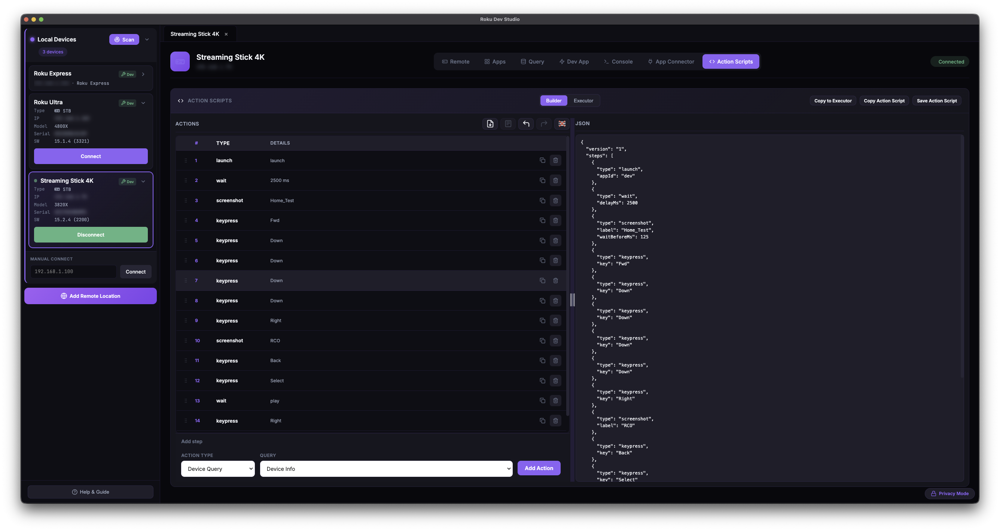
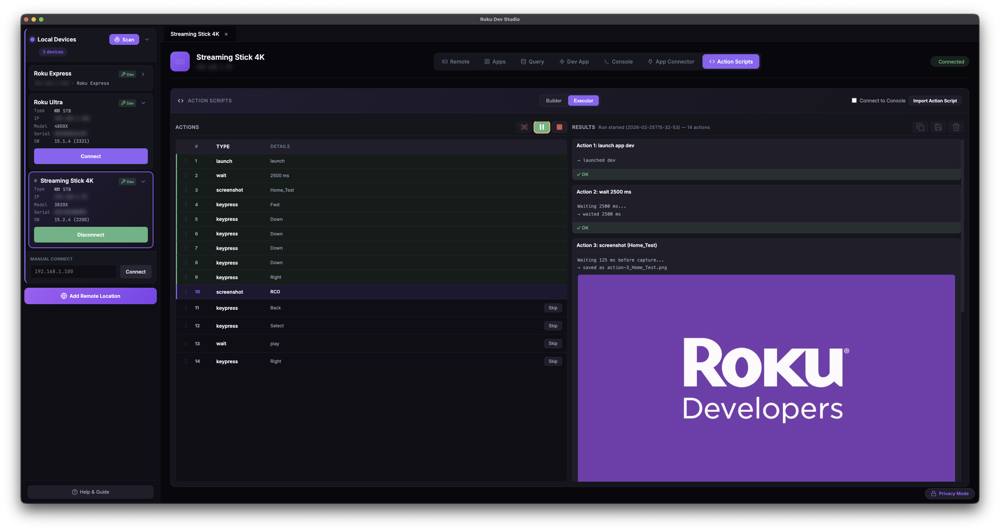

### 🤖 AI Agents (MCP Server)
- **Model Context Protocol:** Bundled `roku-dev-studio-mcp` server lets **Cursor**, **Claude Desktop**, and **VS Code** drive a real Roku through this app while it's open
- **Settings → MCP Server:** Toggle a client to add or remove its `roku-dev-studio` MCP entry; other entries in that client's MCP config are left untouched
- **Two surfaces:** Direct device ops for one-shot actions (`keypress`, `launch_app`, `screenshot`, `app_function`, `rale_command`, `telnet_connect` / `get_telnet_log` / `telnet_disconnect`, …) plus **Action Scripts** for multi-step / conditional flows that drop into the Builder for human review
- **Toasts on agent actions:** Destructive ops surface a non-blocking toast in the app so you always see what the agent did
- **Passwords stay local:** Sideload / screenshot / delete-sideload reuse the password the device panel remembered — the agent never sends one
- See **[`packages/roku-dev-studio-mcp/README.md`](packages/roku-dev-studio-mcp/README.md)** for the tool catalog, bridge protocol, and design notes

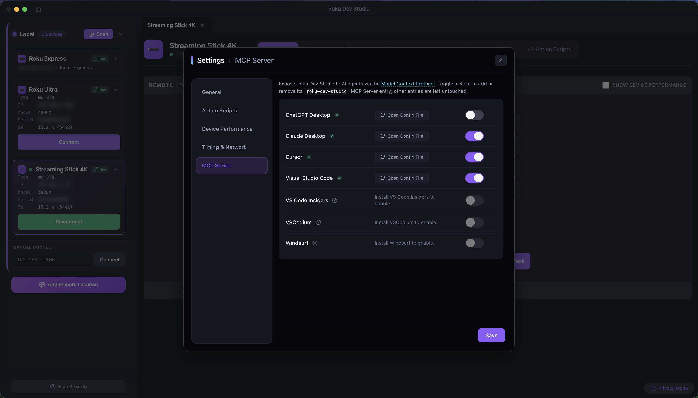

Each row is one supported host (Cursor, Claude Desktop, VS Code, Visual Studio Code Insiders, VSCodium, ChatGPT Desktop, Windsurf). Toggling a row writes / removes only the `roku-dev-studio` entry in that client's MCP config — other entries in the same file are left untouched. **Open Config File** opens the rendered JSON for inspection. Hosts that aren't installed are disabled with an inline hint.

### 🧪 BrightScript Fiddle
- **Open Fiddle:** *File → Open Fiddle* (`Ctrl/Cmd+Shift+B`) or the *Open Fiddle* button on the Query tab
- **Monaco + brighterscript:** BrightScript editor with live linting; the Run button is disabled while errors are present
- **One-click run:** Wraps your snippet into a minimal SceneGraph channel ([`roku-components/fiddle/`](roku-components/README.md#fiddle)), sideloads it on the selected device, and streams the BrightScript debug console (`8085`) into the Fiddle window
- **Auto-cleanup:** Stop / window close removes the Fiddle channel from the device

| Fiddle window (desktop) |
|:---:|
|  |
| **Same snippet running on the Roku** |
|  |

### 📂 Log File Viewer
- **Open saved logs:** *File → Open Log File* (`Ctrl/Cmd+Shift+O`) opens a dedicated window with the same find / structured-log / URL-detection chrome as the live Console tab — handy for triaging logs from a previous session or a teammate

### 📋 Static Channel Analysis
- **Wraps Roku's own `sca-cmd`:** Runs Roku's static-analysis CLI against a packaged channel — RDS downloads the tool at runtime and checks for updates, never ships it
- **Filters:** Severity (Info / Warning / Error) and category (Manifest, Deprecated APIs / Components, RAF, Channel Store, Authentication, Billing, Deep Linking, Analytics, Performance, Monitoring, …)
- **Results table:** Cert Requirements chips link straight to the relevant section of Roku's certification / ad-requirements / Roku Pay docs; Documentation links open Roku's API reference for the flagged method
- **Terminal + Table tabs:** Live raw tool output alongside a structured, filterable results table; View JSON / Save the full report
- **Requires Java 21+:** RDS detects your Java install and reports version compatibility before running
- *File → Static Channel Analysis* (`Ctrl/Cmd+Shift+S`)

### 🛠 `rds` CLI (terminal)
- Ships with [`roku-dev-studio-api`](packages/roku-dev-studio-api/README.md#cli-rds): `rds discover`, `rds device info`, `rds keypress`, `rds launch`, `rds ecp query`, `rds sideload`, `rds screenshot`, `rds script validate / run`, `rds rale repl`, `rds appconnector connect` — works direct over LAN or against a `--relay` server URL.

### 🌐 Remote Server Support
- **Internet Bridge:** Control Roku devices over the internet via remote server
- **Full ECP Proxy:** Complete ECP protocol implementation through server
- **Device Discovery:** Automatically discovers all Roku devices on remote network
- **All Features Supported:** Remote control, queries, sideloading, console, and RALE work remotely
- **Swagger API:** Interactive API documentation for remote server
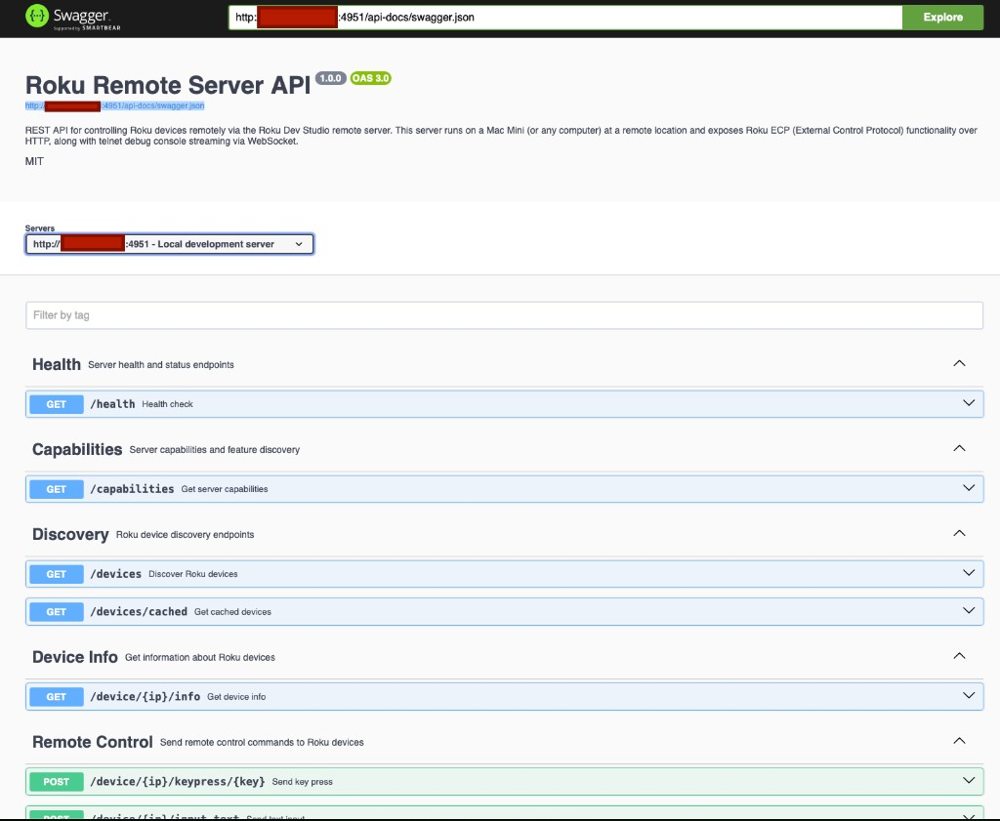

Setup instructions (running the relay server, opening the port, connecting from the desktop app) live in the **[remote server package README](packages/roku-dev-studio-remote-server/README.md)**.

### ⚙️ Settings
Open with `Ctrl/Cmd+,` (or *Roku Dev Studio → Settings* on macOS, *File → Settings* on Windows / Linux). Seven sections:

- **General:** Developer Mode, Privacy Mode (mask IPs / serials), Debug Logging to file, Roku Remote - Use Keyboard, Auto Connect to Devices, Auto Hide SideBar, Language, Show Try Demo App Button, Show Crash Reports
- **Action Scripts:** Default folder for run artifacts (screenshots, exported PDFs)
- **Device Performance:** Chart sample interval, chart history window, *Remember 'Show Device Performance'* per device
- **Timing & Network:** Connection / query / telnet timeouts and other knobs (with *Reset to Defaults*)
- **Network Inspector:** Enable the local MITM proxy and hotspot packet capture, with per-platform capture setup
- **Sideload Relay:** Advertise RDS as a Roku and fan one sideload out to many devices; set the Relay Dev Password and target devices (off by default)
- **MCP Server:** Toggle `roku-dev-studio` in your AI client(s) — see [AI Agents (MCP Server)](#ai-agents-mcp-server) above for the screenshot

| General | Action Scripts |
|:---:|:---:|
| 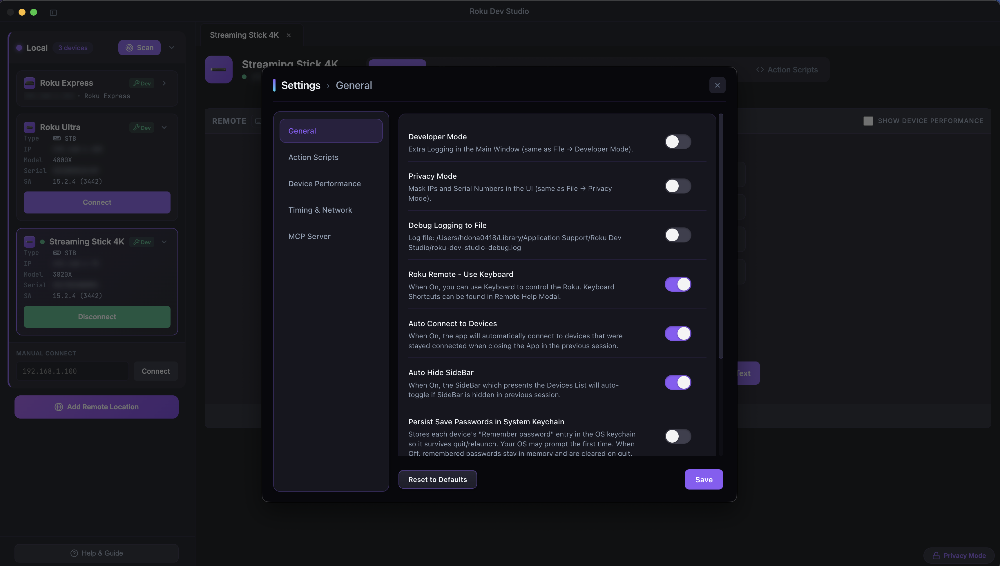 | 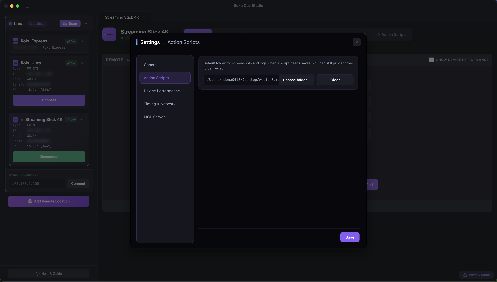 |
| **Device Performance** | **Timing & Network** |
|  | 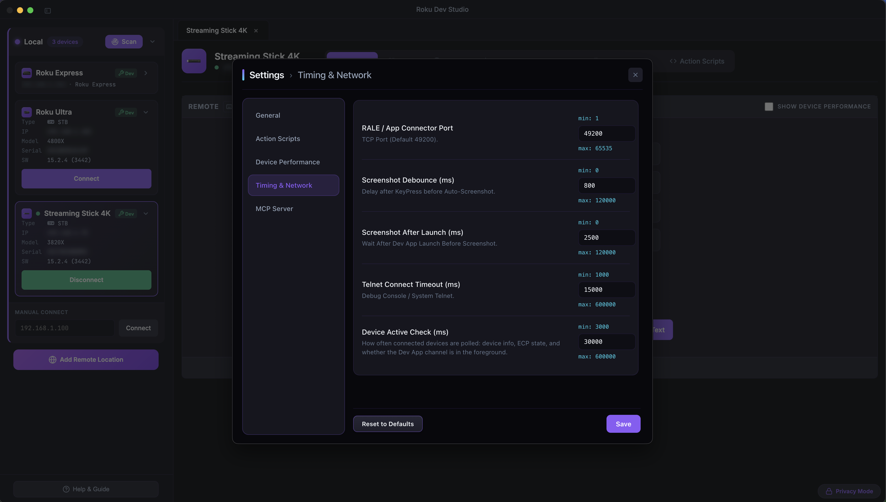 |

### 🌍 Language Switching
- **6 languages:** English, Español, Українська, Polski, Română, Português — pick one from **Settings → General → Language**, or leave it on **System Default** to follow the OS
- **No restart needed:** Switching retranslates the whole app, including already-open windows, immediately

### 💥 Crash Reporting
- **Actionable failure reports:** An uncaught error in the app itself (not your device) shows a report modal instead of failing silently, with a prefilled **GitHub issue** link
- **Redacted by default:** IPs and MAC addresses are stripped from the report before display, copy, or submission
- **Toggle in Settings → General:** **Show Crash Reports** is on by default; turn it off to suppress the modal

### 🛠️ Developer Features
- **Developer Mode:** Enhanced debugging and development features (`Ctrl/Cmd+Shift+D`)
- **Privacy Mode:** Mask IP addresses and serial numbers in UI (`Ctrl/Cmd+Shift+P`)
- **Debug Logging to file:** Optional file-based debug logging in app userData (`Ctrl/Cmd+Shift+L`)
- **Encrypted dev-password storage:** "Remember password" persists the Dev Password through Electron `safeStorage` — backed by macOS Keychain, Windows DPAPI, secret-service, or kwallet where available; UI shows the storage backend status (`encrypted` / `unencrypted` / `unavailable`)
- **Settings persistence:** Preferences and device connections saved between sessions
- **Quick Remote (Dev App tab):** Compact remote strip plus drag-drop sideload right next to the screenshot pane
- **Secret Screens modal:** One-click presets for Roku's hidden screens — Developer Settings, Secret Screens 1–3, Wi-Fi info, Channel Info, Reboot variants — opened from the Remote Section and Query footer
- **TrackerTask Export:** *Save TrackerTask.xml* from the App Connector → Integration Guide drops a ready-to-ship copy into your channel
- **Clear Cache and Reload:** Wipe Chromium cache without restarting the app (File menu)
