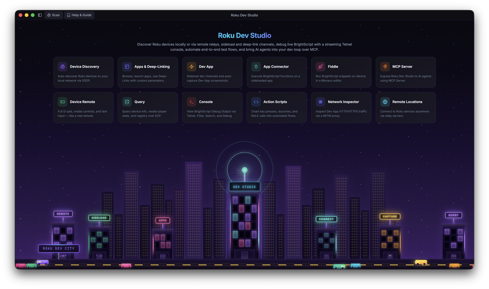

<h1>
  
  &nbsp;Roku Dev Studio
</h1>


[](https://glama.ai/mcp/servers/paramount-engineering/roku-dev-studio)

**Roku Developer Tools** for macOS, Windows, and Linux — Remote Control, App Side-loading, ECP automation, RALE / App Connector, Network Inspector, Action Scripts, MCP server for AI agents (Cursor, Claude, VS Code), and a `rds` CLI. Supports both local network and internet-bridged devices.

A comprehensive cross-platform desktop application for controlling and developing on Roku devices over your local network or via remote server using the External Control Protocol (ECP).

This repository is an **npm workspace** monorepo. Run **`npm install`** and **`npm start`** from the **repository root** so workspaces link correctly. Installing runs a `postinstall` (`npm run build:libs`) that compiles the shared `roku-dev-studio-platform` and `roku-dev-studio-api` packages to their `dist/` outputs, which the app and remote server import. Use **`npm run typecheck`** for a full TypeScript check across every workspace and **`npm test`** to run unit tests. CI runs these plus per-package build/syntax smoke checks on each push and pull request. Setup, scripts, and distributable builds are documented in **[INSTALLATION.md](INSTALLATION.md)**.

## Repository layout

| Location | What it is |
|----------|------------|
| **[`apps/roku-dev-studio/`](apps/roku-dev-studio/)** | Electron desktop app (main process, renderer, packaging). Dev and distributable builds: **[INSTALLATION.md](INSTALLATION.md)**. |
| **[`packages/roku-dev-studio-api/`](packages/roku-dev-studio-api/)** | Shared Node library + **`rds` CLI**: discovery, ECP, screenshots, sideload, RALE, action-script runner, headless validator — [package README](packages/roku-dev-studio-api/README.md). |
| **[`packages/roku-dev-studio-mcp/`](packages/roku-dev-studio-mcp/)** | **MCP server** that lets AI agents (Cursor, Claude Desktop, VS Code) drive a Roku through this app — [package README](packages/roku-dev-studio-mcp/README.md). |
| **[`packages/roku-dev-studio-network-inspector/`](packages/roku-dev-studio-network-inspector/)** | Network Inspector engine: hotspot packet capture (DNS/SNI/HTTP) + local MITM proxy, transport-agnostic so it runs in both the desktop app and the remote server — [package README](packages/roku-dev-studio-network-inspector/README.md). |
| **[`packages/roku-dev-studio-remote-server/`](packages/roku-dev-studio-remote-server/)** | HTTP/WebSocket relay to control Rokus over the internet — [package README](packages/roku-dev-studio-remote-server/README.md). |
| **[`packages/roku-dev-studio-platform/`](packages/roku-dev-studio-platform/)** | Shared host-platform helpers (OS identity, modifier keys, `path-safe`, node-only filesystem helpers) used by the app and other packages so platform logic lives in one place. Built to `dist/` on `npm install` — [package README](packages/roku-dev-studio-platform/README.md). |
| **[`roku-components/`](roku-components/)** | BrightScript-side artifacts: `TrackerTask.xml` (drop into your channel for App Connector / RALE) and the `fiddle/` SceneGraph scaffold — [components README](roku-components/README.md). |

**Author:** Hareendra Donapati

## Glossary

| Term | One-line meaning |
|------|------------------|
| **ECP** | External Control Protocol — Roku's HTTP API on port `8060` (KeyPress, Launch, Query, Deep-Link). |
| **Telnet 8085 / 8080** | The BrightScript debug console (`8085`) and dev system commands (`8080`) on a Developer-Mode Roku. |
| **RALE** | Roku Advanced Layout Editor — Roku's SceneGraph inspection protocol over a TCP socket (default port `49200`), spoken by the `TrackerTask` component. |
| **TrackerTask** | The BrightScript component channel developers add to their app to make it reachable from RALE / App Connector — see [`roku-components/README.md`](roku-components/README.md). |
| **App Connector** | The Dev Studio tab that talks RALE: list / call your channel's `GetExternalControlFunctions`, plus built-ins (node lookup, registry editor, update node). |
| **Network Inspector** | The Dev Studio tab / engine that inspects a dev channel's HTTP(S) traffic through a local MITM proxy, with optional hotspot packet capture. |
| **Sideload** | Uploading and installing a `.zip` / `.pkg` dev channel onto a Developer-Mode Roku via its Dev Password. |
| **Sideload Relay** | RDS advertising itself as a Roku so one sideload from your IDE / browser fans out (install → launch → console) to many targeted devices. |
| **Action Script** | JSON-described automation that chains keypresses, queries, sideload, App Connector calls, screenshots, conditionals, waits, and variables. Built and run from the *Action Scripts* tab; also runnable headless via `rds`. |
| **MCP server** | Roku Dev Studio's **Model Context Protocol** server — lets Cursor / Claude Desktop / VS Code drive a real device through this app while it's open. Toggle clients in **Settings → MCP Server**. |
| **Fiddle** | The BrightScript scratch editor (Monaco + brighterscript lint) that wraps your snippet into a temporary channel and runs it on a selected device. |
| **`rds`** | The terminal CLI shipped by `roku-dev-studio-api` (`rds discover`, `rds keypress`, `rds script run`, `rds rale repl`, …). |

## Supported Platforms

Roku Dev Studio is available for:

| Platform | Options |
|----------|---------|
| macOS | DMG installer, Portable ZIP archive |
| Windows | NSIS installer, Portable executable |
| Linux | DEB package, AppImage |

---

|           Home           |
|--------------------------|
|  |

## Features

See **[FEATURES.md](FEATURES.md)** for the full tour with screenshots. Quick index:

Remote Control ([Floating Remote](FEATURES.md#remote-control)) · [Device Performance](FEATURES.md#device-performance) · [Device Discovery](FEATURES.md#device-discovery) · [App Launcher & Management](FEATURES.md#app-launcher) · [Device Queries](FEATURES.md#device-queries) · [Dev App Management](FEATURES.md#dev-app-management) · [Sideload Relay](FEATURES.md#sideload-relay) · [Console & Debugging](FEATURES.md#console-debugging) · [BrightScript Debugger](FEATURES.md#brightscript-debugger) · [App Connector (RALE)](FEATURES.md#app-connector) · [Network Inspector](FEATURES.md#network-inspector) · [Network Session Viewer](FEATURES.md#network-session-viewer) · [Action Scripts](FEATURES.md#action-scripts) · [AI Agents (MCP Server)](FEATURES.md#ai-agents-mcp-server) · [BrightScript Fiddle](FEATURES.md#brightscript-fiddle) · [Log File Viewer](FEATURES.md#log-file-viewer) · [Static Channel Analysis](FEATURES.md#static-channel-analysis) · [`rds` CLI](FEATURES.md#rds-cli) · [Remote Server Support](FEATURES.md#remote-server-support) · [Settings](FEATURES.md#settings) · [Developer Features](FEATURES.md#developer-features)

## Remote Server Setup

Roku Dev Studio can control devices over the internet using a remote server bridge, so you can manage devices in Remote Locations without being on the same network as the desktop app. Run the relay (`npm run remote-server` from this repo, or `npm install -g roku-dev-studio-remote-server`), then add its URL via **Add Remote Location** in the device selector.

Full setup (running the server as a service, network/firewall configuration, the HTTP/WebSocket API, and Swagger docs) lives in the **[remote server package README](packages/roku-dev-studio-remote-server/README.md)**.

## Project structure

```
.
├── apps/
│   └── roku-dev-studio/                 # Electron desktop app (see INSTALLATION.md)
├── packages/
│   ├── roku-dev-studio-api/             # Shared API + `rds` CLI (npm: roku-dev-studio-api)
│   ├── roku-dev-studio-mcp/             # MCP server bundled into the desktop app
│   ├── roku-dev-studio-network-inspector/ # Network capture + MITM proxy engine
│   ├── roku-dev-studio-platform/        # Shared platform helpers (path-safe, OS identity)
│   └── roku-dev-studio-remote-server/   # HTTP/WS relay (npm: roku-dev-studio-remote-server)
├── roku-components/                     # TrackerTask + Fiddle SceneGraph assets
├── package.json                         # Workspace root (workspaces: apps/*, packages/*)
├── INSTALLATION.md
└── README.md
```

The Electron app’s own tree (TypeScript **`main.ts`** / **`preload.ts`** bundled to **`main.bundled.cjs`** / **`preload.bundled.cjs`**, **`renderer/`**, build assets) lives under **`apps/roku-dev-studio/`**.

## Requirements

### For Running the App:
- Node.js 24.17+
- npm (bundled with Node.js)
- Roku device on local network (or remote server for remote access)

### For Building:
- All of the above
- Platform-specific build tools:
  - **macOS:** Xcode Command Line Tools
  - **Windows:** Windows SDK (for NSIS installer)
  - **Linux:** Standard build tools (gcc, make, etc.)

See **[Installation](INSTALLATION.md)** for setup and build instructions.

## License

This project is licensed under the [MIT License](LICENSE).

**Third-party components** used in this software and their licences:

| Library | Purpose | Licence |
|---------|---------|---------|
| [@tanstack/virtual-core](https://tanstack.com/virtual) | Virtualized list rendering (telnet console, large script results) | [MIT](https://opensource.org/licenses/MIT) |
| [archiver](https://github.com/archiverjs/node-archiver) | Building sideload `.zip` packages | [MIT](https://opensource.org/licenses/MIT) |
| [brighterscript](https://github.com/rokucommunity/brighterscript) | BrightScript linting in the Fiddle editor | [MIT](https://opensource.org/licenses/MIT) |
| [commander](https://github.com/tj/commander.js) | `rds` CLI argument parsing | [MIT](https://opensource.org/licenses/MIT) |
| [electron](https://www.electronjs.org/) | Desktop app runtime | [MIT](https://opensource.org/licenses/MIT) |
| [electron-builder](https://www.electron.build/) | Packaging & installers | [MIT](https://opensource.org/licenses/MIT) |
| [form-data](https://github.com/form-data/form-data) | HTTP multipart uploads | [MIT](https://opensource.org/licenses/MIT) |
| [modern-screenshot](https://github.com/qq15725/modern-screenshot) | DOM-to-image capture for chart cards / PDF export | [MIT](https://opensource.org/licenses/MIT) |
| [monaco-editor](https://microsoft.github.io/monaco-editor/) | Code editor (Fiddle, action-script step editors) | [MIT](https://opensource.org/licenses/MIT) |
| [pdf-lib](https://pdf-lib.js.org/) | PDF generation | [MIT](https://opensource.org/licenses/MIT) |
| [sharp](https://sharp.pixelplumbing.com/) | Image processing (icons/build) | [Apache-2.0](https://opensource.org/licenses/Apache-2.0) |
| [solid-js](https://www.solidjs.com/) | Reactive framework powering the new renderer | [MIT](https://opensource.org/licenses/MIT) |
| [ws](https://github.com/websockets/ws) | WebSocket client | [MIT](https://opensource.org/licenses/MIT) |

Their dependencies are used under the terms declared in `package-lock.json` and each package’s repository.

