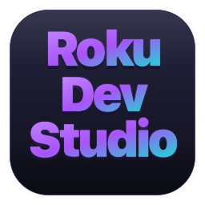
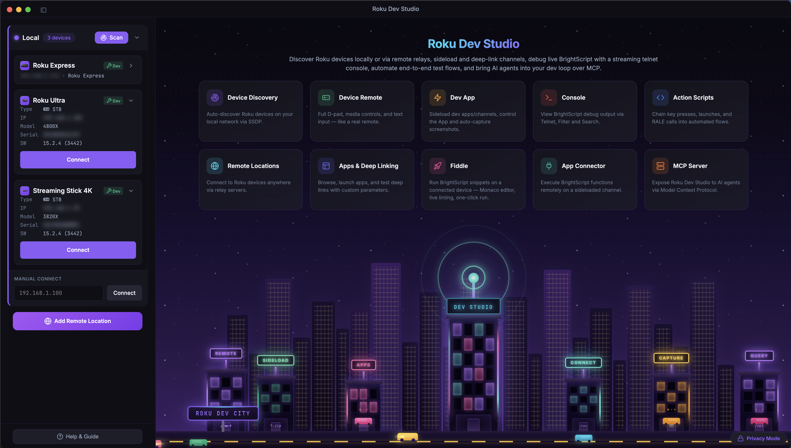
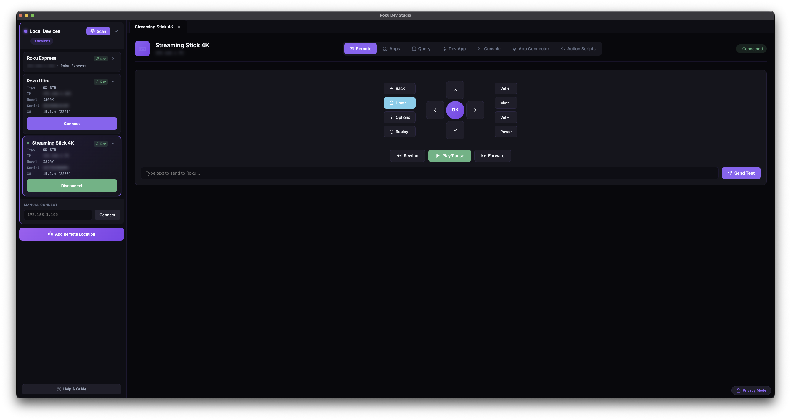
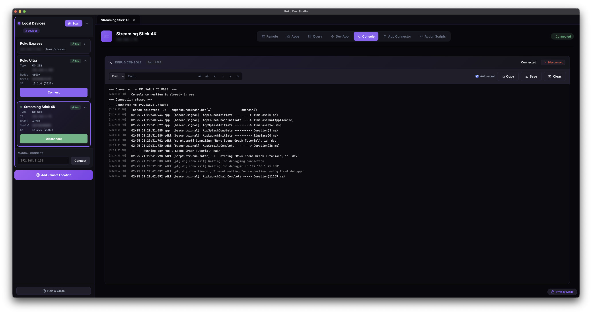
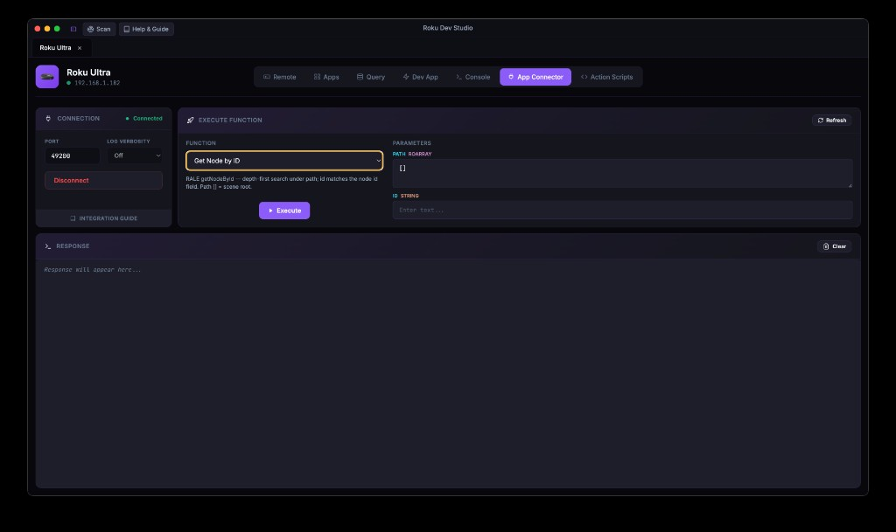
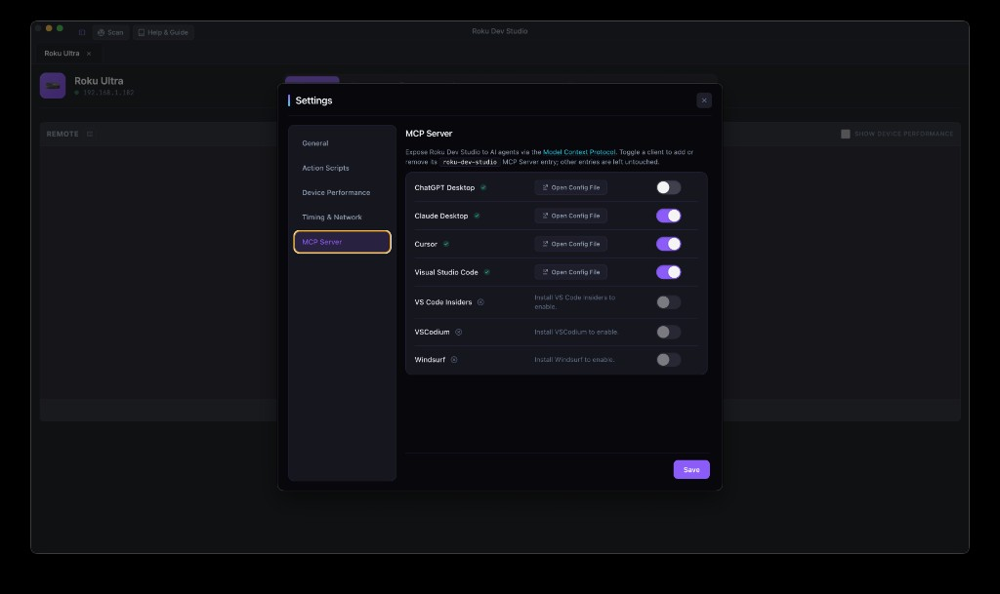
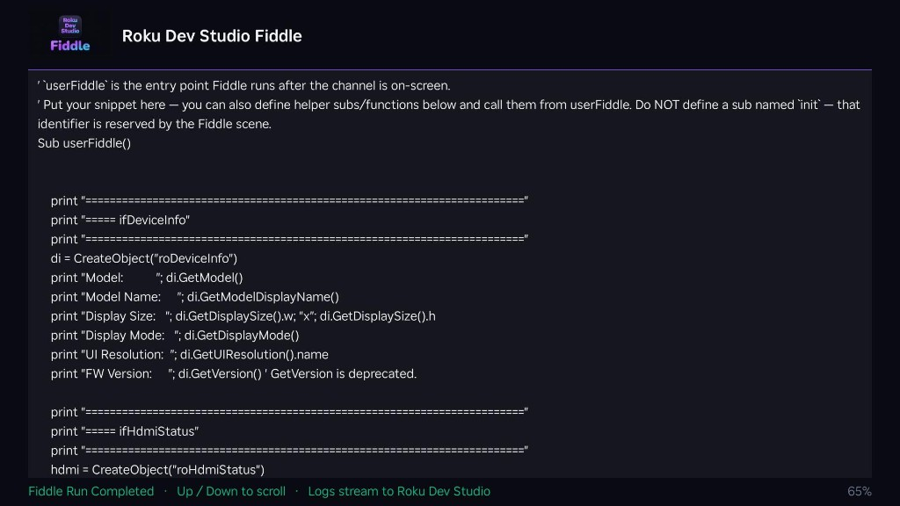
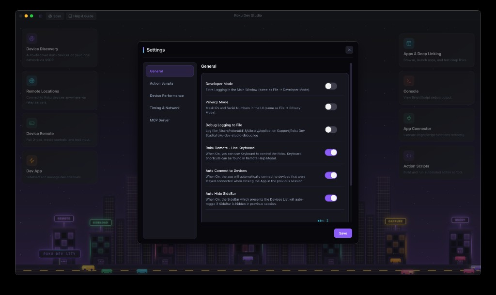
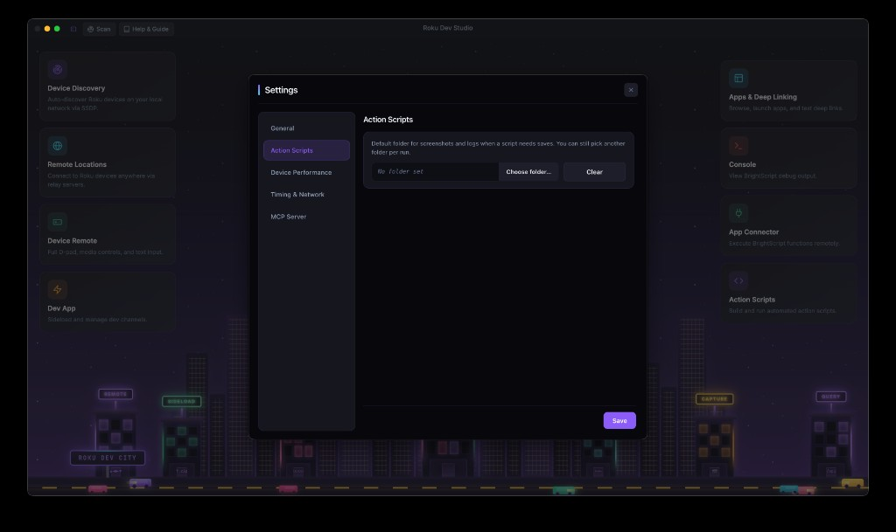
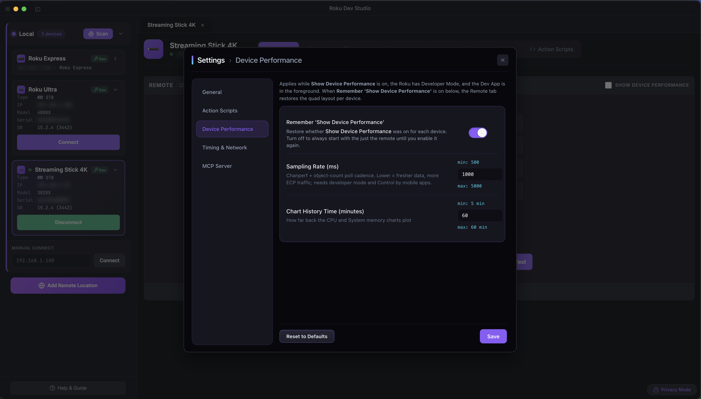

<h1>
  
  &nbsp;Roku Dev Studio
</h1>


[](https://glama.ai/mcp/servers/paramount-engineering/roku-dev-studio)

A comprehensive cross-platform desktop application for controlling and developing on Roku devices over your local network or via remote server using the External Control Protocol (ECP).

This repository is an **npm workspace** monorepo. Run **`npm install`** and **`npm start`** from the **repository root** so workspaces link correctly. Installing runs a `postinstall` (`npm run build:libs`) that compiles the shared `roku-dev-studio-platform` and `roku-dev-studio-api` packages to their `dist/` outputs, which the app and remote server import. Use **`npm run typecheck`** for a full TypeScript check across every workspace and **`npm test`** to run unit tests. CI runs these plus per-package build/syntax smoke checks on each push and pull request. Setup, scripts, and distributable builds are documented in **[INSTALLATION.md](INSTALLATION.md)**.

## Repository layout

| Location | What it is |
|----------|------------|
| **[`apps/roku-dev-studio/`](apps/roku-dev-studio/)** | Electron desktop app (main process, renderer, packaging). Dev and distributable builds: **[INSTALLATION.md](INSTALLATION.md)**. |
| **[`packages/roku-dev-studio-api/`](packages/roku-dev-studio-api/)** | Shared Node library + **`rds` CLI**: discovery, ECP, screenshots, sideload, RALE, action-script runner, headless validator — [package README](packages/roku-dev-studio-api/README.md). |
| **[`packages/roku-dev-studio-mcp/`](packages/roku-dev-studio-mcp/)** | **MCP server** that lets AI agents (Cursor, Claude Desktop, VS Code) drive a Roku through this app — [package README](packages/roku-dev-studio-mcp/README.md). |
| **[`packages/roku-dev-studio-network-inspector/`](packages/roku-dev-studio-network-inspector/)** | Network Inspector engine: hotspot packet capture (DNS/SNI/HTTP) + local MITM proxy, transport-agnostic so it runs in both the desktop app and the remote server. |
| **[`packages/roku-dev-studio-remote-server/`](packages/roku-dev-studio-remote-server/)** | HTTP/WebSocket relay to control Rokus over the internet — [package README](packages/roku-dev-studio-remote-server/README.md). |
| **[`packages/roku-dev-studio-platform/`](packages/roku-dev-studio-platform/)** | Shared host-platform helpers (OS identity, modifier keys, `path-safe`, node-only filesystem helpers) used by the app and other packages so platform logic lives in one place. Built to `dist/` on `npm install`. |
| **[`roku-components/`](roku-components/)** | BrightScript-side artifacts: `TrackerTask.xml` (drop into your channel for App Connector / RALE) and the `fiddle/` SceneGraph scaffold — [components README](roku-components/README.md). |

**Author:** Hareendra Donapati

## Glossary

| Term | One-line meaning |
|------|------------------|
| **ECP** | External Control Protocol — Roku's HTTP API on port `8060` (keypress, launch, query, deep link). |
| **Telnet 8085 / 8080** | The BrightScript debug console (`8085`) and dev system commands (`8080`) on a Developer-Mode Roku. |
| **RALE** | Roku Advanced Layout Editor — Roku's SceneGraph inspection protocol over a TCP socket (default port `49200`), spoken by the `TrackerTask` component. |
| **TrackerTask** | The BrightScript component channel developers add to their app to make it reachable from RALE / App Connector — see [`roku-components/README.md`](roku-components/README.md). |
| **App Connector** | The Dev Studio tab that talks RALE: list / call your channel's `GetExternalControlFunctions`, plus built-ins (node lookup, registry editor, update node). |
| **Network Inspector** | The Dev Studio tab / engine that inspects a dev channel's HTTP(S) traffic through a local MITM proxy, with optional hotspot packet capture. |
| **Sideload** | Uploading and installing a `.zip` / `.pkg` dev channel onto a Developer-Mode Roku via its Dev Password. |
| **Sideload Relay** | RDS advertising itself as a Roku so one sideload from your IDE / browser fans out (install → launch → console) to many targeted devices. |
| **Action Script** | JSON-described automation that chains keypresses, queries, sideload, App Connector calls, screenshots, conditionals, waits, and variables. Built and run from the *Action Scripts* tab; also runnable headless via `rds`. |
| **MCP server** | Roku Dev Studio's **Model Context Protocol** server — lets Cursor / Claude Desktop / VS Code drive a real device through this app while it's open. Toggle clients in **Settings → MCP Server**. |
| **Fiddle** | The BrightScript scratch editor (Monaco + brighterscript lint) that wraps your snippet into a temporary channel and runs it on a selected device. |
| **`rds`** | The terminal CLI shipped by `roku-dev-studio-api` (`rds discover`, `rds keypress`, `rds script run`, `rds rale repl`, …). |

## Supported Platforms

Roku Dev Studio is available for:

| Platform | Options |
|----------|---------|
| macOS | DMG installer, Portable ZIP archive |
| Windows | NSIS installer, Portable executable |
| Linux | DEB package, AppImage |

---

|           Home           |
|--------------------------|
|  |

## Features

### 🎮 Remote Control
- **Full D-Pad Control:** Navigate menus, select items, go back/home
- **Media Controls:** Play, pause, rewind, fast-forward, volume control
- **Optional Keyboard Remote:** Enable in **Settings → General → Roku Remote - Use Keyboard** (off by default); then arrow keys, Enter, Backspace, Escape, Space, etc. work as the remote on the **Remote** tab (solo layout or device-performance quad) or **Dev App** tab for the open device, not in other UI.
- **Visual Remote Interface:** On-screen remote with all buttons
- **Works Locally & Remotely:** Control devices on local network or via remote server


### 📊 Device Performance (Remote tab)
- **Live charts:** On **Remote**, turn on **Show Device Performance** for a quad layout with **CPU**, **memory**, and **object** charts (count or memory view where available).
- **When it applies:** Charts reflect the running app when the device has **Developer Mode** on and your **sideloaded dev channel** is in the foreground.
- **Settings → Device Performance:** Tune chart **sample interval** and **history** window; optional **Remember 'Show Device Performance'** restores whether the quad was on **per device** between sessions.
- **Action Scripts:** Add **Device Performance** steps to capture chart cards into run results (for example PNGs included when you export results to PDF).


### 🔍 Device Discovery
- **Automatic SSDP Discovery:** Automatically finds Roku devices on your local network
- **Subnet Scanning:** Fallback discovery method when SSDP multicast is unavailable
- **Remote Device Discovery:** Discover devices on remote networks via server bridge
- **Real-time Updates:** Devices appear as they're discovered

### 📱 App Launcher & Management
- **Installed Apps Browser:** View and launch all apps installed on the device
- **App Icons:** Display actual app icons loaded from the device in a grid layout
- **Custom App Launch:** Launch any app by entering App ID
- **Deep Linking:** Launch apps with specific content (movies, shows, channels)
- **HDMI Inputs:** Switch to HDMI inputs on TV devices
- **Remote Launch:** Launch apps on remote devices via server


### 🔬 Device Queries
- **Device Info:** Get device name, model, serial, software version, network info
- **All Apps:** List all installed apps with details
- **Active App:** Get currently running app information
- **Media Player:** Query current media playback status
- **SceneGraph Nodes:** Query all nodes or root nodes
- **SG Rendezvous:** Get SceneGraph events and track/untrack
- **FW Beacons:** Query firmware beacons
- **Plugins & Memory:** Get plugin info and memory usage
- **System Commands:** Execute system-level commands via telnet (port 8080)
- **Command History:** View and re-run previous commands
- **Custom Queries:** Run any custom ECP query endpoint


### ⚡ Dev App Management
- **Remote Sideloading:** Upload and install dev channels to local or remote devices
- **Auto Screenshot:** Automatically capture screenshots after keypresses, text input, and Dev App Launch (when enabled)
- **Launch Dev App:** Launch sideloaded dev channel with one click
- **Delete Sideload:** Remove sideloaded channel remotely
- **Dev App Status:** View currently sideloaded app information
- **Progress Tracking:** Real-time upload progress for sideloading


### 📡 Sideload Relay
- **One build → many devices:** With the relay on, Roku Dev Studio advertises itself as a Roku over SSDP; point your IDE (VS Code BrightScript / roku-deploy) or a browser at this machine, upload once, and RDS fans the build out (install → launch → console) to every targeted device — local or at a remote location
- **Enable in Settings → Sideload Relay** (off by default): set a **Relay Dev Password** (how your IDE authenticates to RDS) and pick targets in **Setup Devices**
- **Browser upload page:** A themed drag-and-drop `.zip` uploader is served at the relay address for sideloads without an IDE
- **Auto-connect:** Each device that receives a build opens as a connected tab with its debug console attached; live fan-out progress streams on telnet `8085`
- **Source approval:** A sideload from another machine prompts for allow / deny on the RDS host; remote browser uploads also require the Relay Dev Password

### 💻 Console & Debugging
- **Telnet Console Access:** Direct access to Roku console logs (port 8085)
- **Remote Console:** Access console logs on remote devices via server
- **Real-time Output:** See console log output in real-time
- **System Commands:** Execute system commands via telnet (port 8080)
- **Log Export:** Save console logs to file


### 🔌 App Connector (using RALE)
- **RALE Connection:** Connect to TrackerTask in your dev app (default port `49200`)
- **Function Discovery:** Auto-discover everything `GetExternalControlFunctions` exposes in your scene
- **Remote Execution:** Execute any BrightScript function with parameters; positional `functionParams` array
- **Return Values:** Get function return values in real-time
- **Update Node:** After **Get Node by ID**, open the *Update Node* modal to `selectNode`, `setField`, or `removeField` on the matched node
- **RALE built-ins:** Node lookup (`getNodeById`, `getNodeByName`) plus a full **registry editor** — get all sections, add / update section, remove section, set / edit / remove section key, clear all
- **Integration Guide modal:** In-app TrackerTask tutorial with BrightScript snippets, supported parameter types, and a *Save TrackerTask.xml* button
- **Remote Function Calls:** Works on local and remote devices via server


### 🕵️ Network Inspector
- **MITM proxy:** A local proxy decrypts your dev channel's HTTPS so you can inspect full request / response headers and bodies — enable it in **Settings → Network Inspector** and point your channel at the proxy address shown
- **Hotspot capture (optional):** Records SNI / DNS metadata for all device traffic via OS packet capture (macOS BPF, Windows Npcap)
- **Session list & filters:** Filter by `host:`, `method:`, `status:`, `type:`, `kind:`, `path:` (comma = OR), group by host, and jump to errors
- **Inspect & export:** View request / response overview, headers, and bodies (JSON / XML / raw); copy a body or export as **cURL** / **HAR**; save captured packets as **.pcap**
- **Traffic rules:** Block all proxied traffic, throttle bandwidth / latency (device-wide or per host), and set per-host / path **Block** / **Reset** / **Mock** responses
- Available for locally connected devices; engine lives in [`roku-dev-studio-network-inspector`](packages/roku-dev-studio-network-inspector/)

### 📜 Action Scripts
- **Script Builder:** Create scripted sequences with keypresses, send-text, ECP query / POST, launch, sideload, delete-sideload, screenshots, App Connector Function calls, RALE commands, Device Performance chart capture, and waits
- **Variables (script v2):** *Set Variable* step or `assignToVar` on Device Query / App Function / RALE Command stores values; reference them as `${name}` in later step fields
- **Conditionals (script v2):** *If / Else if / Else* branches sourced from `media-player` state, the active app, a RALE node field, or a stored variable; branches can nest
- **Wait conditions:** Fixed `delayMs`, or wait until a condition becomes true — `media-player` state, or `rale-node-field` polling `getNodeById` with operators (`equals`, `contains`, `matches`, `hasAnyValue`, …) plus optional `timeoutMs` / `pollIntervalMs`
- **Per-step help:** Context-aware help modal for every action type
- **Script Executor:** Import / paste / validate, run with pause / resume / stop, per-step skip, drag-drop reorder, inline screenshots in results
- **PDF export:** Run results — including screenshots and Device Performance chart cards — exportable as PDF
- **Headless / CLI:** Same scripts run from the terminal via [`rds script run`](packages/roku-dev-studio-api/README.md#cli-rds)


### 🤖 AI Agents (MCP Server)
- **Model Context Protocol:** Bundled `roku-dev-studio-mcp` server lets **Cursor**, **Claude Desktop**, and **VS Code** drive a real Roku through this app while it's open
- **Settings → MCP Server:** Toggle a client to add or remove its `roku-dev-studio` MCP entry; other entries in that client's MCP config are left untouched
- **Two surfaces:** Direct device ops for one-shot actions (`keypress`, `launch_app`, `screenshot`, `app_function`, `rale_command`, `telnet_connect` / `get_telnet_log` / `telnet_disconnect`, …) plus **Action Scripts** for multi-step / conditional flows that drop into the Builder for human review
- **Toasts on agent actions:** Destructive ops surface a non-blocking toast in the app so you always see what the agent did
- **Passwords stay local:** Sideload / screenshot / delete-sideload reuse the password the device panel remembered — the agent never sends one
- See **[`packages/roku-dev-studio-mcp/README.md`](packages/roku-dev-studio-mcp/README.md)** for the tool catalog, bridge protocol, and design notes



Each row is one supported host (Cursor, Claude Desktop, VS Code, Visual Studio Code Insiders, VSCodium, ChatGPT Desktop, Windsurf). Toggling a row writes / removes only the `roku-dev-studio` entry in that client's MCP config — other entries in the same file are left untouched. **Open Config File** opens the rendered JSON for inspection. Hosts that aren't installed are disabled with an inline hint.

### 🧪 BrightScript Fiddle
- **Open Fiddle:** *File → Open Fiddle* (`Ctrl/Cmd+Shift+B`) or the *Open Fiddle* button on the Query tab
- **Monaco + brighterscript:** BrightScript editor with live linting; the Run button is disabled while errors are present
- **One-click run:** Wraps your snippet into a minimal SceneGraph channel ([`roku-components/fiddle/`](roku-components/README.md#fiddle)), sideloads it on the selected device, and streams the BrightScript debug console (`8085`) into the Fiddle window
- **Auto-cleanup:** Stop / window close removes the Fiddle channel from the device

| Fiddle window (desktop) |
|:---:|
|  |
| **Same snippet running on the Roku** |
|  |

### 📂 Log File Viewer
- **Open saved logs:** *File → Open Log File* (`Ctrl/Cmd+Shift+O`) opens a dedicated window with the same find / structured-log / URL-detection chrome as the live Console tab — handy for triaging logs from a previous session or a teammate

### 🛠 `rds` CLI (terminal)
- Ships with [`roku-dev-studio-api`](packages/roku-dev-studio-api/README.md#cli-rds): `rds discover`, `rds device info`, `rds keypress`, `rds launch`, `rds ecp query`, `rds sideload`, `rds screenshot`, `rds script validate / run`, `rds rale repl`, `rds appconnector connect` — works direct over LAN or against a `--relay` server URL.

### 🌐 Remote Server Support
- **Internet Bridge:** Control Roku devices over the internet via remote server
- **Full ECP Proxy:** Complete ECP protocol implementation through server
- **Device Discovery:** Automatically discovers all Roku devices on remote network
- **All Features Supported:** Remote control, queries, sideloading, console, and RALE work remotely
- **Swagger API:** Interactive API documentation for remote server

### ⚙️ Settings
Open with `Ctrl/Cmd+,` (or *Roku Dev Studio → Settings* on macOS, *File → Settings* on Windows / Linux). Seven sections:

- **General:** Developer Mode, Privacy Mode (mask IPs / serials), Debug Logging to file, Roku Remote - Use Keyboard, Auto Connect to Devices, Auto Hide SideBar
- **Action Scripts:** Default folder for run artifacts (screenshots, exported PDFs)
- **Device Performance:** Chart sample interval, chart history window, *Remember 'Show Device Performance'* per device
- **Timing & Network:** Connection / query / telnet timeouts and other knobs (with *Reset to Defaults*)
- **Network Inspector:** Enable the local MITM proxy and hotspot packet capture, with per-platform capture setup
- **Sideload Relay:** Advertise RDS as a Roku and fan one sideload out to many devices; set the Relay Dev Password and target devices (off by default)
- **MCP Server:** Toggle `roku-dev-studio` in your AI client(s) — see [AI Agents (MCP Server)](#-ai-agents-mcp-server) above for the screenshot

| General | Action Scripts |
|:---:|:---:|
|  |  |
| **Device Performance** | **Timing & Network** |
|  |  |

### 🛠️ Developer Features
- **Developer Mode:** Enhanced debugging and development features (`Ctrl/Cmd+Shift+D`)
- **Privacy Mode:** Mask IP addresses and serial numbers in UI (`Ctrl/Cmd+Shift+P`)
- **Debug Logging to file:** Optional file-based debug logging in app userData (`Ctrl/Cmd+Shift+L`)
- **Encrypted dev-password storage:** "Remember password" persists the Dev Password through Electron `safeStorage` — backed by macOS Keychain, Windows DPAPI, secret-service, or kwallet where available; UI shows the storage backend status (`encrypted` / `unencrypted` / `unavailable`)
- **Settings persistence:** Preferences and device connections saved between sessions
- **Quick Remote (Dev App tab):** Compact remote strip plus drag-drop sideload right next to the screenshot pane
- **Secret Screens modal:** One-click presets for Roku's hidden screens — Developer Settings, Secret Screens 1–3, Wi-Fi info, Channel Info, Reboot variants — opened from the Remote tab and Query footer
- **TrackerTask Export:** *Save TrackerTask.xml* from the App Connector → Integration Guide drops a ready-to-ship copy into your channel
- **Clear Cache and Reload:** Wipe Chromium cache without restarting the app (File menu)


## Remote Server Setup

Roku Dev Studio can control devices over the internet using a remote server bridge. This lets you manage devices in remote locations without being on the same network as the desktop app.

### 1. Run the relay server

**Option A — From this repo:**

```bash
git clone https://github.com/paramount-engineering/roku-dev-studio.git
cd roku-dev-studio
npm install
npm run remote-server     # listens on port 4951 by default
```

**Option B — From npm:**

```bash
npm install -g roku-dev-studio-remote-server
roku-remote-server        # or: roku-remote-server 4951
```

See the [remote server package README](packages/roku-dev-studio-remote-server/README.md) for the full HTTP/WebSocket API and Swagger docs.

### 2. Configure the network

- Open the chosen port (default `4951`) on the host running the relay.
- For internet exposure, prefer a VPN or tunnel rather than a public-internet port.

### 3. Connect from the desktop app

- Click **Add Remote Location** in the device selector.
- Enter the server URL (e.g. `http://remote-server-ip:4951`).
- Click **Connect** to discover remote devices.

### Remote Server Features

- **Full ECP Proxy:** All ECP commands work through the server
- **Device Discovery:** Automatically finds devices on remote network
- **Telnet Relay:** Console access (ports 8085 & 8080) via WebSocket
- **File Upload:** Sideload dev apps from your desktop to remote devices
- **Swagger API:** Interactive API documentation at `/api-docs`

See the [remote server package README](packages/roku-dev-studio-remote-server/README.md) for detailed setup instructions and API documentation.


## Troubleshooting

### Connection Issues

1. **Ensure Roku and computer are on the same network**
2. **Control by Mobile Apps (ECP):**  
   Settings → System → Advanced system settings → Control by mobile apps → **Network access**. The app supports all four modes:
   - **Disabled** – Remote control is off; the app shows a warning and blocks remote/keypress areas.
   - **Limited** – Text input, app launch, and app query work; full remote keypress may not. The app shows an "ECP Limited" badge and adapts.
   - **Permissive** – Full control; Roku accepts commands only from private network or same subnet. If you see a "Check Network" warning, ensure this computer is on the same subnet.
   - **Enabled** – Full control on private network addresses.
3. **Firewall:** Allow connections on port 8060

### Building Issues

- **macOS code signing:** For distribution, you'll need an Apple Developer certificate
- **Windows builds on macOS:** Use a Windows VM or GitHub Actions
- **Linux builds:** Ensure required dependencies are installed (see package.json deb.depends)

## Project structure

```
.
├── apps/
│   └── roku-dev-studio/                 # Electron desktop app (see INSTALLATION.md)
├── packages/
│   ├── roku-dev-studio-api/             # Shared API + `rds` CLI (npm: roku-dev-studio-api)
│   ├── roku-dev-studio-mcp/             # MCP server bundled into the desktop app
│   ├── roku-dev-studio-network-inspector/ # Network capture + MITM proxy engine
│   ├── roku-dev-studio-platform/        # Shared platform helpers (path-safe, OS identity)
│   └── roku-dev-studio-remote-server/   # HTTP/WS relay (npm: roku-dev-studio-remote-server)
├── roku-components/                     # TrackerTask + Fiddle SceneGraph assets
├── package.json                         # Workspace root (workspaces: apps/*, packages/*)
├── INSTALLATION.md
└── README.md
```

The Electron app’s own tree (TypeScript **`main.ts`** / **`preload.ts`** bundled to **`main.bundled.cjs`** / **`preload.bundled.cjs`**, **`renderer/`**, build assets) lives under **`apps/roku-dev-studio/`**.

## Requirements

### For Running the App:
- Node.js 18+ 
- npm 9+
- Roku device on local network (or remote server for remote access)

### For Building:
- All of the above
- Platform-specific build tools:
  - **macOS:** Xcode Command Line Tools
  - **Windows:** Windows SDK (for NSIS installer)
  - **Linux:** Standard build tools (gcc, make, etc.)

See **[Installation](INSTALLATION.md)** for setup and build instructions.

## License

This project is licensed under the [MIT License](LICENSE).

**Third-party components** used in this software and their licences:

| Library | Purpose | Licence |
|---------|---------|---------|
| [@tanstack/virtual-core](https://tanstack.com/virtual) | Virtualized list rendering (telnet console, large script results) | [MIT](https://opensource.org/licenses/MIT) |
| [archiver](https://github.com/archiverjs/node-archiver) | Building sideload `.zip` packages | [MIT](https://opensource.org/licenses/MIT) |
| [brighterscript](https://github.com/rokucommunity/brighterscript) | BrightScript linting in the Fiddle editor | [MIT](https://opensource.org/licenses/MIT) |
| [commander](https://github.com/tj/commander.js) | `rds` CLI argument parsing | [MIT](https://opensource.org/licenses/MIT) |
| [electron](https://www.electronjs.org/) | Desktop app runtime | [MIT](https://opensource.org/licenses/MIT) |
| [electron-builder](https://www.electron.build/) | Packaging & installers | [MIT](https://opensource.org/licenses/MIT) |
| [form-data](https://github.com/form-data/form-data) | HTTP multipart uploads | [MIT](https://opensource.org/licenses/MIT) |
| [modern-screenshot](https://github.com/qq15725/modern-screenshot) | DOM-to-image capture for chart cards / PDF export | [MIT](https://opensource.org/licenses/MIT) |
| [monaco-editor](https://microsoft.github.io/monaco-editor/) | Code editor (Fiddle, action-script step editors) | [MIT](https://opensource.org/licenses/MIT) |
| [pdf-lib](https://pdf-lib.js.org/) | PDF generation | [MIT](https://opensource.org/licenses/MIT) |
| [sharp](https://sharp.pixelplumbing.com/) | Image processing (icons/build) | [Apache-2.0](https://opensource.org/licenses/Apache-2.0) |
| [solid-js](https://www.solidjs.com/) | Reactive framework powering the new renderer | [MIT](https://opensource.org/licenses/MIT) |
| [ws](https://github.com/websockets/ws) | WebSocket client | [MIT](https://opensource.org/licenses/MIT) |

Their dependencies are used under the terms declared in `package-lock.json` and each package’s repository.

