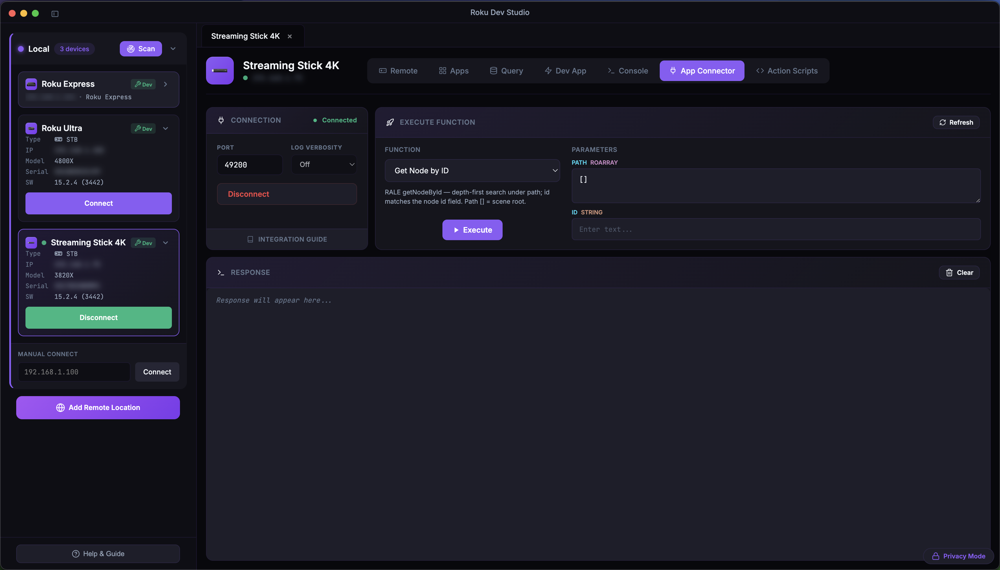
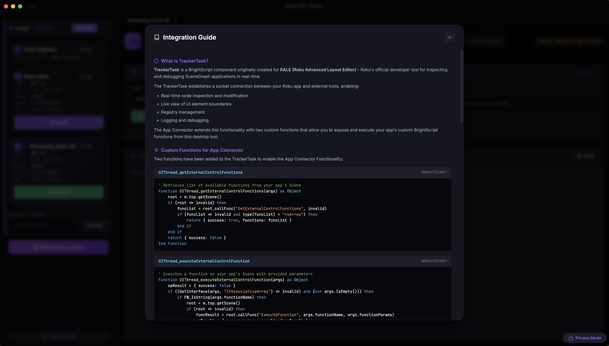
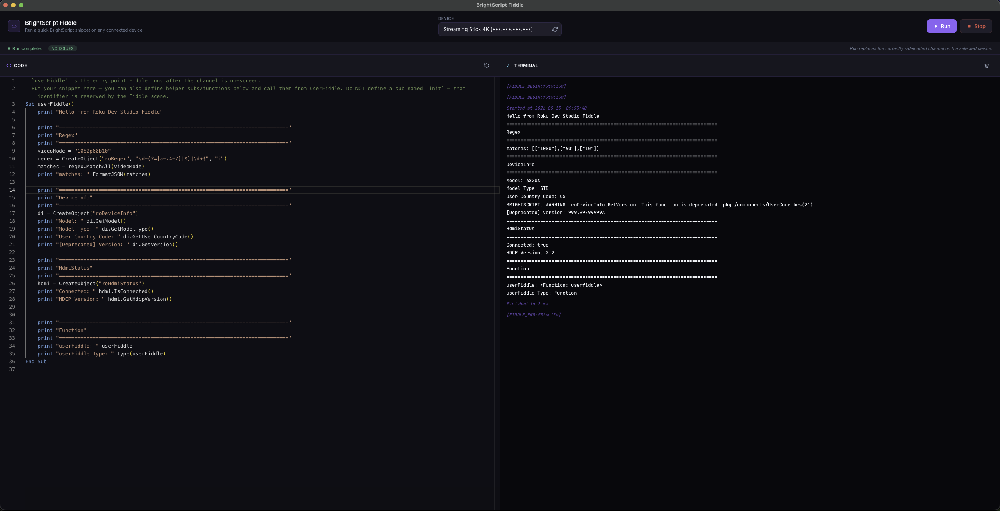
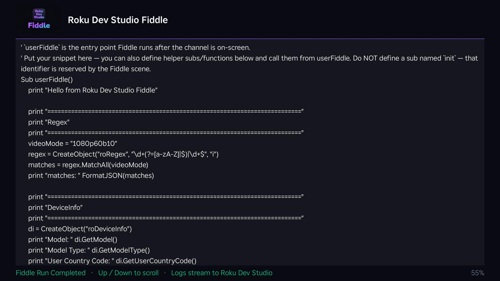

# `roku-components/` — BrightScript-side components

Roku-side BrightScript / SceneGraph artifacts that Roku Dev Studio depends on. Two distinct things live here:

| Path | What it is | Who consumes it |
|------|-----------|-----------------|
| **`TrackerTask.xml`** | The TrackerTask SceneGraph component (Roku's own RALE component, with two extra hooks for the Dev Studio App Connector). Roku channel developers drop this into their own app's `components/` folder to make their channel reachable from the Dev Studio Inspector / App Connector / `rale_command` MCP tool / `rds rale` CLI. | **External — Roku channel developers** integrating their channel with Roku Dev Studio. |
| **`fiddle/`** | A minimal SceneGraph "scratch channel" (manifest, scene component, splash images, `main.brs`). The desktop app sideloads this onto a selected Roku to host **BrightScript Fiddle** — when you click *Run* in the Fiddle window, the editor's code is wrapped into this channel and pushed to the device. | **Internal — Roku Dev Studio itself**. Hand-edits should be rare. |

Neither folder is built or generated; both ship as plain text the way Roku channels expect.

---

## `TrackerTask.xml`

### What it does

`TrackerTask` is a BrightScript component originally created for **RALE (Roku Advanced Layout Editor)** — Roku's developer tool for live SceneGraph inspection. It opens a TCP socket inside the running channel and answers JSON commands like `getNodeById`, `getRegistrySections`, `selectNode`, `setField`, etc.

Roku Dev Studio's **App Connector** speaks the same protocol over the same socket. On top of the standard RALE surface this copy adds **two channel-side hooks** so you can expose your own BrightScript functions to the desktop app:

- `UIThread_getExternalControlFunctions` — discovery; returns the list of function names + parameter shapes your scene exposes.
- `UIThread_executeExternalControlFunction` — dispatch; calls one of those functions with positional `functionParams`.

Both routes call into your scene via `root.callFunc("GetExternalControlFunctions", …)` / `root.callFunc("ExecuteFunction", …)` — your scene declares those two interface functions and decides what to expose. The full integration tutorial lives in the in-app **Integration Guide** modal (App Connector tab → *Integration Guide*).

### How channel developers add it to their channel

1. Copy `TrackerTask.xml` into your channel's `components/` folder (or use **App Connector → Integration Guide → Save TrackerTask.xml** in Dev Studio to drop it directly).
2. Spawn the task once at channel start:

   ```brightscript
   m.trackerTask = createObject("roSGNode", "TrackerTask")
   m.trackerTask.control = "RUN"
   ```

3. In your `MainScene.xml`, declare the two interface functions and implement them in `MainScene.brs`:

   ```xml
   <interface>
     <function name="GetExternalControlFunctions" />
     <function name="ExecuteFunction" />
   </interface>
   ```

4. Sideload your channel as usual (Dev Studio's **Dev App** tab), then in **App Connector** click **Connect** (default port `49200`).

Once connected, the **App Connector** tab pulls your channel's function list (via `GetExternalControlFunctions`) into the *Function* picker on the right and exposes the RALE built-ins (`Get Node by ID`, registry CRUD, …) too:



The **Integration Guide** button (left column, under the connection panel) opens an in-app modal with the worked BrightScript examples for both interface functions, the supported parameter types (`Boolean`, `Integer`, `LongInteger`, `Float`, `Double`, `String`, `roAssociativeArray`, `roArray`, `roList`), end-to-end calling patterns, and a *Save TrackerTask.xml* button:



**Hypothetical** function names used in the tutorial (e.g. `PlayContent`, `SetUserPreferences`) are illustrative only — your scene exposes whatever you want via `GetExternalControlFunctions`.

### Editing this file

`TrackerTask.xml` is the published copy that Roku channel developers ship inside their channels. Avoid editing it unless you're intentionally changing the Dev Studio ↔ channel protocol. If you do edit it:

- Keep the standard RALE surface (`getNodeById`, `setField`, `selectNode`, registry CRUD, etc.) unchanged so RALE compatibility doesn't break.
- Bump anything that depends on a new field/function in lockstep across the desktop app (`apps/roku-dev-studio/main/mcp-bridge.ts`, `packages/roku-dev-studio-api/lib/rale.js`, validators in `packages/roku-dev-studio-api/lib/validate-action-script.ts`, the MCP capability bundle in `packages/roku-dev-studio-mcp/src/resources.ts`).

---

## `fiddle/`

A self-contained SceneGraph channel that powers the **BrightScript Fiddle** window (File → Open Fiddle, or `Cmd/Ctrl+Shift+B`).

```
fiddle/
├── manifest                       # Channel manifest (title / icons / splash)
├── components/
│   ├── FiddleScene.xml            # Empty Scene that hosts the user's snippet
│   └── FiddleScene.brs            # Picks up the snippet and runs it
├── source/
│   └── main.brs                   # SceneGraph entry point
└── images/                        # Channel icon (HD / FHD)
```

When you press **Run** in the Fiddle window the desktop app:

1. Wraps the Monaco editor's source into a temporary copy of this channel.
2. Sideloads the wrapped channel to the selected Roku (with the Dev App developer password).
3. Streams the BrightScript debug console (port 8085) into the Fiddle window's terminal pane.
4. On window close (or Stop), deletes the sideloaded channel.

| Fiddle window (desktop) | Same snippet running on the TV |
|:---:|:---:|
|  |  |

The window's *DEVICE* picker chooses which connected Roku the snippet sideloads onto, the left pane is Monaco with **brighterscript** live linting (the *Run* button is disabled while errors are present), and the right pane streams everything `print` writes to the debug console (port 8085) framed by `[FIDDLE_BEGIN:<id>]` / `[FIDDLE_END:<id>]` so you can tell one run from the next. On the device itself the Fiddle channel mirrors the snippet's source on screen with a footer hint (Up/Down to scroll, run state in the corner) so you can see at a glance what's installed without alt-tabbing back to the desktop.

`apps/roku-dev-studio/main/ipc/bs-fiddle-handlers.ts` matches the `manifest` `title=` line against `/query/apps` to confirm a sideloaded channel is the Dev Studio Fiddle one before deleting it. **Keep `title=Roku Dev Studio Fiddle` in sync** with `FIDDLE_CHANNEL_TITLE` in that handler if you ever rename it; otherwise the cleanup path will leave the Fiddle channel installed on the device.

### Editing the fiddle channel

This is a regular Roku channel — you can sideload it standalone and run it through `r2d2_bitmaps`-style debugging if you need to. But for everyday work the Fiddle window is the editor you want; don't hand-author code into `source/main.brs` or `components/FiddleScene.brs` unless you're changing the host scaffold itself.

If the manifest changes (e.g. a new icon, a different splash colour), the next sideload from a Fiddle window will pick it up — no rebuild step is needed inside the desktop app.

---

## See also

- **`apps/roku-dev-studio/renderer/components/modals/fragments/integration-guide-modal.html`** — the in-app TrackerTask integration tutorial, what most channel developers actually read.
- **`apps/roku-dev-studio/main/ipc/bs-fiddle-handlers.ts`** — Fiddle build / sideload / delete plumbing on the desktop side.
- **`apps/roku-dev-studio/renderer/components/fiddle/fiddle.ts`** — Fiddle window renderer (Monaco + brighterscript lint + Run wiring).
- **`packages/roku-dev-studio-api/`** — RALE + ECP + sideload helpers that talk to whatever channel includes `TrackerTask.xml`.
- **`packages/roku-dev-studio-mcp/`** — MCP server exposing the same RALE surface to AI agents (`rale_command`, `rale_get_node_by_id`, `app_function`, `app_connector_connect`, …).
